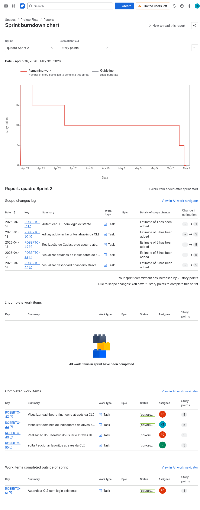
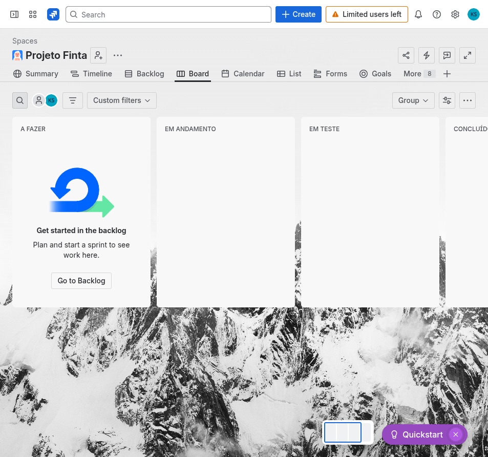
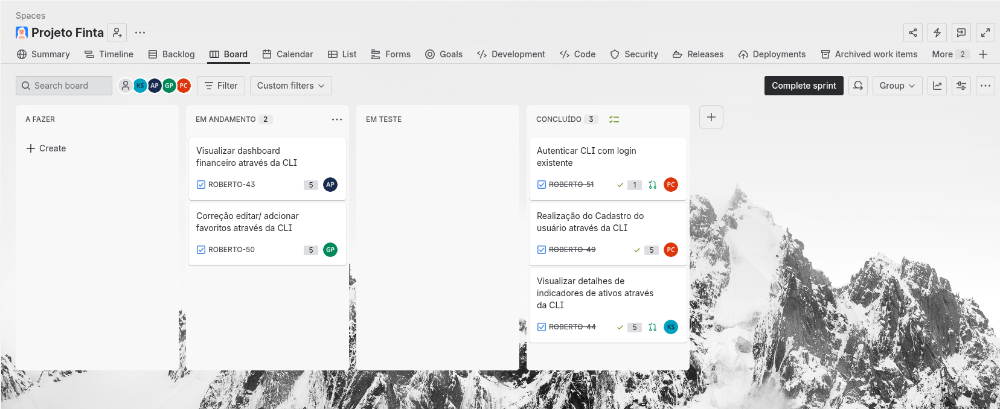
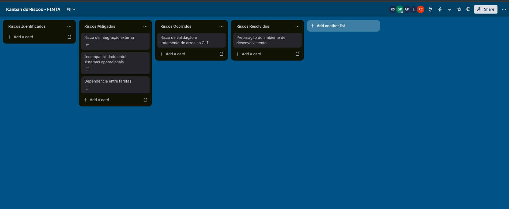
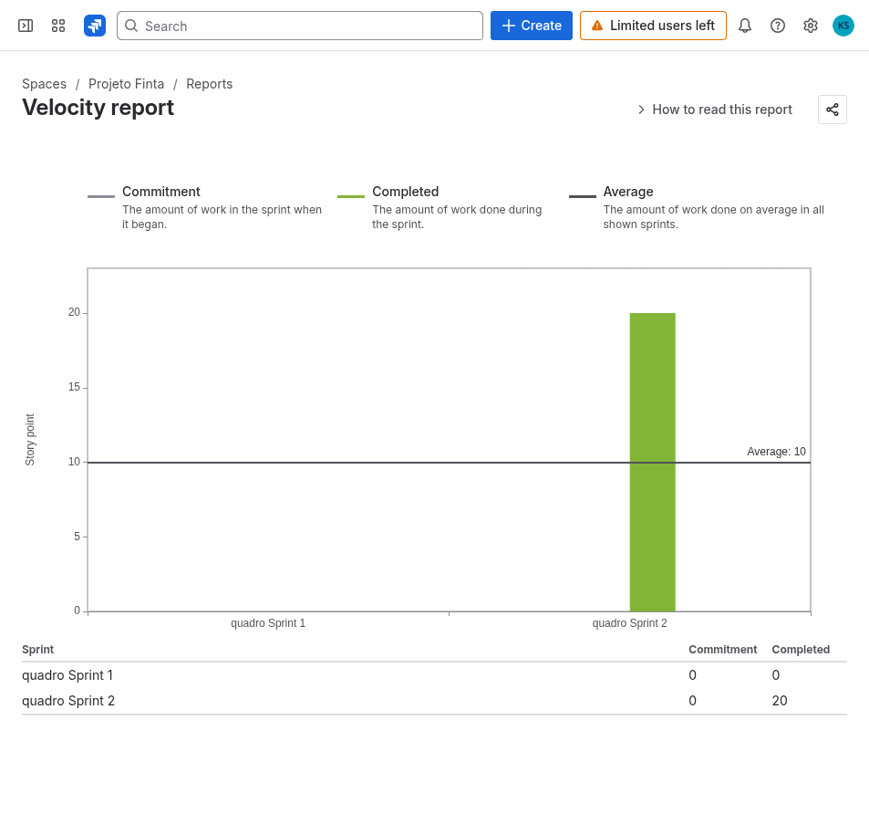

# Encerramento da Sprint 2 - Projeto Finta

## Slide 1 - Objetivo do Encerramento

Encerrar a Sprint 2 por meio da revisão das entregas realizadas, validação dos critérios de aceite, análise dos indicadores finais e retrospectiva do semestre.

O foco da Sprint 2 foi a evolução do Finta por meio da criação e integração da CLI, permitindo que funcionalidades principais do produto fossem acessadas pelo terminal.

## Slide 2 - Contexto do Projeto

O Finta é uma aplicação de acompanhamento financeiro voltada para centralizar informações de mercado e facilitar a consulta de indicadores, ativos e favoritos.

Principais funcionalidades do produto:

- Consulta de ativos financeiros.
- Visualização de dashboard financeiro.
- Autenticação de usuários.
- Gestão de favoritos.
- Interface web e interface por linha de comando.

Repositório final do projeto:

https://github.com/p4cs-974/projeto-finta

## Slide 3 - Objetivo da Sprint 2

O objetivo da Sprint 2 foi implementar a CLI do Finta, permitindo que o usuário interagisse com funcionalidades centrais do sistema diretamente pelo terminal.

Na prática, a sprint buscou entregar:

- Cadastro de usuário pela CLI.
- Login/autenticação pela CLI.
- Dashboard financeiro no terminal.
- Visualização de detalhes de ativos.
- Adição, edição e remoção de favoritos pela CLI.

## Slide 4 - Histórias Concluídas na Sprint 2

| Ticket | História de usuário | Status no Jira | Responsável | Pontos |
| --- | --- | --- | --- | ---: |
| ROBERTO-43 | Visualizar dashboard financeiro através da CLI | Concluído | Pedro Custódio | 5 |
| ROBERTO-44 | Visualizar detalhes de indicadores de ativos através da CLI | Concluído | Kawan Mark Geronimo da Silva | 5 |
| ROBERTO-49 | Realização do cadastro do usuário através da CLI | Concluído | Pedro Custódio | 5 |
| ROBERTO-50 | Editar/adicionar favoritos através da CLI | Concluído | Gabriel Albertini Pinheiro | 5 |
| ROBERTO-51 | Autenticar CLI com login existente | Concluído fora da sprint | Pedro Custódio | 1 |

Resumo:

- 4 histórias foram concluídas oficialmente dentro da Sprint 2.
- 1 história foi concluída fora da sprint, mas também foi entregue no produto.
- Não houve histórias incompletas registradas no relatório da Sprint 2.

## Slide 5 - Evidência do Jira: Burndown e Itens da Sprint

O relatório de burndown do Jira mostra a Sprint 2 como `quadro Sprint 2`.

No relatório, as histórias ROBERTO-43, ROBERTO-44, ROBERTO-49 e ROBERTO-50 aparecem em `Completed work items`.

A história ROBERTO-51 aparece como `Work items completed outside of sprint`, ou seja, foi concluída, mas não contabilizou dentro da sprint no Jira.

## Slide 6 - Validação dos Critérios de Aceite

| História | Critério de aceite | Validação realizada |
| --- | --- | --- |
| ROBERTO-43 | Usuário consegue visualizar dashboard financeiro pela CLI | Validado pela implementação da tela/resumo financeiro no terminal |
| ROBERTO-44 | Usuário consegue visualizar detalhes de indicadores de ativos pela CLI | Validado pela consulta e apresentação de informações de ativos |
| ROBERTO-49 | Usuário consegue realizar cadastro pela CLI | Validado pelo fluxo de criação de conta via terminal |
| ROBERTO-50 | Usuário consegue editar/adicionar favoritos pela CLI | Validado pelo fluxo de gestão de favoritos e testes relacionados |
| ROBERTO-51 | Usuário consegue autenticar a CLI com login existente | Validado pelo fluxo de login/autenticação pelo terminal |

Além da validação funcional, o projeto possui testes automatizados em partes da CLI, incluindo favoritos, formatação do dashboard, cliente de API, autenticação e distribuição da CLI.

## Slide 7 - Kanban da Sprint

Situação final:

- As histórias principais da Sprint 2 foram concluídas.
- O Jira não apresentou itens incompletos no relatório da sprint.
- A coluna `Concluído` representa o estado final das entregas implementadas.

Imagem complementar registrada durante o acompanhamento da sprint:

## Slide 8 - Kanban de Riscos

Riscos acompanhados na Sprint 2:

| Risco | Impacto | Situação final |
| --- | --- | --- |
| Incompatibilidade entre sistemas operacionais | A CLI poderia se comportar de forma diferente em Windows, Linux e macOS | Ocorreu parcialmente; a equipe priorizou funcionamento em ambientes Unix-like |
| Integração com APIs externas | Falhas externas poderiam impedir consulta de cotações | Risco monitorado e mitigado com tratamento de erros |
| Validação e tratamento de erros na CLI | Entradas inválidas poderiam prejudicar a experiência do usuário | Mitigado com validações e testes |
| Ambiente de desenvolvimento | Configuração de pacotes e variáveis poderia atrasar entregas | Mitigado com padronização de comandos e documentação |

## Slide 9 - Indicadores Finais da Sprint

| Indicador | Resultado | Interpretação |
| --- | --- | --- |
| Burndown | Sprint 2 registrada no Jira com itens concluídos | Mostra a evolução da queima do trabalho planejado |
| Lead Time | Aproximadamente 27 dias | Tempo entre criação/entrada dos itens e entrega final |
| Cycle Time | Aproximadamente 3 dias | Tempo médio de desenvolvimento ativo dos itens |
| Throughput | 4 histórias concluídas dentro da sprint; 5 histórias entregues no total | Quantidade de itens entregues |
| Velocidade | 20 pontos no Jira; 21 pontos considerando a issue concluída fora da sprint | Pontos entregues na sprint |
| WIP | Controlado pelo Kanban | Acompanhamento de tarefas simultaneamente em andamento |

Observação importante:

O Velocity Report do Jira contabiliza 20 pontos concluídos na Sprint 2 porque a história ROBERTO-51 foi marcada como concluída fora da sprint. Considerando a entrega funcional do projeto, o total entregue foi de 21 pontos.

## Slide 10 - Velocity Report

Dados observados no Jira:

| Sprint | Commitment | Completed |
| --- | ---: | ---: |
| quadro Sprint 1 | 0 | 0 |
| quadro Sprint 2 | 0 | 20 |

Interpretação:

- A velocidade oficial registrada para a Sprint 2 foi de 20 pontos.
- O commitment aparece como 0 provavelmente porque os itens ou estimativas foram adicionados/configurados depois do início da sprint.
- A entrega real do produto inclui também ROBERTO-51, totalizando 21 pontos implementados.

## Slide 11 - Burndown

O burndown representa a redução do trabalho restante ao longo da sprint.

Na Sprint 2, o gráfico indica a evolução dos itens planejados até sua conclusão. Ele também registra mudanças de escopo, como a inclusão das estimativas em 18/04/2026.

Principais evidências do relatório:

- ROBERTO-43, ROBERTO-44, ROBERTO-49 e ROBERTO-50 aparecem como concluídas na sprint.
- ROBERTO-51 foi concluída fora da sprint.
- Não há itens incompletos registrados.

## Slide 12 - Lead Time e Cycle Time

Lead Time:

- Representa o tempo total desde a criação ou entrada da demanda até sua conclusão.
- Para a Sprint 2, foi considerado aproximadamente 27 dias, conforme registro de criação em 11/04/2026 e finalização em 08/05/2026.

Cycle Time:

- Representa o tempo em que o item ficou efetivamente em desenvolvimento até ser concluído.
- Para a Sprint 2, foi considerado aproximadamente 3 dias.

Interpretação:

- O lead time maior mostra que os itens ficaram no fluxo da sprint por mais tempo.
- O cycle time menor indica que, quando as tarefas entraram em desenvolvimento ativo, foram concluídas em prazo mais curto.

## Slide 13 - Throughput, Velocidade e WIP

Throughput:

- 4 histórias concluídas oficialmente dentro da sprint.
- 5 histórias entregues considerando também a issue concluída fora da sprint.

Velocidade:

- 20 pontos registrados pelo Jira na Sprint 2.
- 21 pontos considerando todas as entregas funcionais.

WIP:

- O WIP foi acompanhado pelo Kanban.
- A equipe buscou evitar excesso de tarefas simultâneas em andamento.
- O quadro permitiu visualizar o fluxo entre `A fazer`, `Em andamento`, `Em teste` e `Concluído`.

## Slide 14 - Retrospectiva: Principais Acertos

Principais acertos da equipe:

- Entrega das principais funcionalidades planejadas para a CLI.
- Boa divisão das tarefas entre os membros.
- Evolução do produto para além da interface web.
- Integração da CLI com funcionalidades centrais do Finta.
- Uso de testes automatizados para reduzir risco de regressão.
- Organização do projeto em monorepo com separação entre apps e pacotes.

## Slide 15 - Retrospectiva: Dificuldades Enfrentadas

Dificuldades enfrentadas:

- Conciliar o desenvolvimento com outras entregas acadêmicas.
- Configurar ambiente de desenvolvimento e variáveis necessárias.
- Garantir compatibilidade da CLI entre diferentes sistemas operacionais.
- Tratar corretamente falhas de API externa e entradas inválidas.
- Manter o Jira totalmente alinhado com o estado real do desenvolvimento.

## Slide 16 - Retrospectiva: Riscos Ocorridos

Riscos que ocorreram ou exigiram atenção:

- Incompatibilidade de sistema operacional na execução da CLI.
- Dependência de APIs externas para consulta de ativos e cotações.
- Possíveis falhas de validação em comandos de terminal.
- Diferença entre o que foi entregue no código e o que foi contabilizado automaticamente pelo Jira.

Tratamento aplicado:

- Priorização de ambientes Unix-like para estabilidade da CLI.
- Melhoria em validações e tratamento de erros.
- Testes automatizados em componentes importantes da CLI.
- Revisão dos relatórios do Jira para recuperar a situação final da sprint.

## Slide 17 - Retrospectiva: Melhorias Aplicadas

Melhorias aplicadas durante o semestre:

- Padronização de comandos com `pnpm`.
- Organização em monorepo com Turborepo.
- Separação de responsabilidades entre backend, frontend, CLI e pacotes compartilhados.
- Criação e manutenção de documentação de apoio.
- Uso de `AGENTS.md` para registrar contexto e instruções do projeto.
- Ampliação de testes na CLI.

## Slide 18 - Retrospectiva: Lições Aprendidas

Lições aprendidas:

- Histórias mais bem descritas geram estimativas melhores.
- O Planning Poker ajudou a alinhar entendimento e complexidade.
- A CLI exige atenção especial a ambiente, sistema operacional e usabilidade no terminal.
- O Kanban ajuda a identificar gargalos e acompanhar fluxo de trabalho.
- É importante manter o Jira atualizado durante a sprint, não apenas no encerramento.
- Entregas pequenas e testáveis facilitam validação e reduzem risco.

## Slide 19 - Histórias Pendentes

Não houve histórias incompletas registradas no relatório da Sprint 2.

Observação:

- ROBERTO-51 foi concluída, mas aparece no Jira como `Work items completed outside of sprint`.
- Portanto, ela não é uma pendência funcional do produto.
- A diferença está apenas na contabilização da sprint pelo Jira.

## Slide 20 - Versão Final no GitHub

A versão final do projeto está disponível no GitHub:

https://github.com/p4cs-974/projeto-finta

O repositório contém:

- Código-fonte do backend Cloudflare.
- Código-fonte do frontend Cloudflare.
- Código-fonte da CLI.
- Pacotes compartilhados.
- Documentação dos laboratórios.
- Evidências de planejamento, acompanhamento e encerramento da sprint.

## Slide 21 - Fechamento

A Sprint 2 atingiu seu objetivo principal: entregar a CLI do Finta com funcionalidades essenciais para uso pelo terminal.

Resultado final:

- 5 histórias entregues funcionalmente.
- 4 histórias contabilizadas oficialmente dentro da sprint pelo Jira.
- 20 pontos registrados no Velocity Report.
- 21 pontos implementados considerando a história concluída fora da sprint.
- Nenhuma história pendente funcional.

Conclusão:

O projeto encerra o semestre com uma versão funcional publicada no GitHub, contendo backend, frontend, CLI, documentação e evidências de gestão da Sprint 2.
