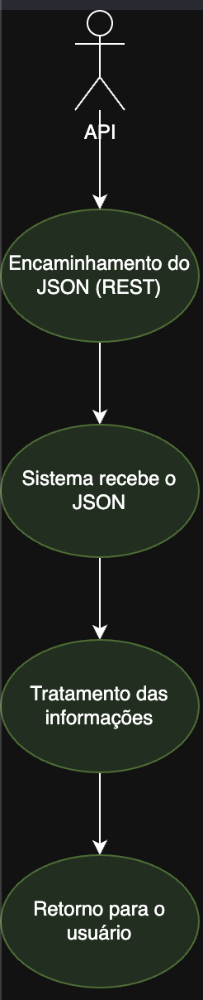
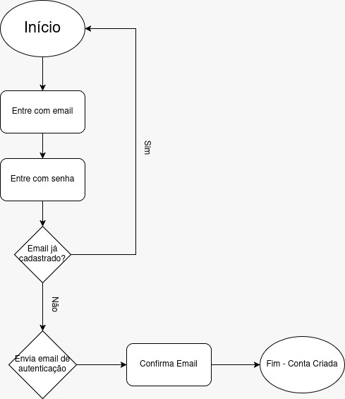

# FINTA (FINancial Tracking & Analysis)

## Domínio

Finanças

## Problema real que o FINTA resolve

Facilitar o acompanhamento de indicadores financeiros, como valor de ações, taxa selic, entre outros.

## Principais usuários

	Pessoas interessadas em acompanhar variações do mercado financeiro como um todo.

## Principais funcionalidades

- Acompanhar ações.
- Comparar taxas de financiamento.
- Autenticação.
- Favoritos.

## Processos de negódio
> Identificados em [Processos-de-negocio.md](Processos-de-negocio.md).

### Acompanhar ações

### Autenticação (cadastro)

## Linguagem e framework

	Backend: Node.js
	Frontend: React
