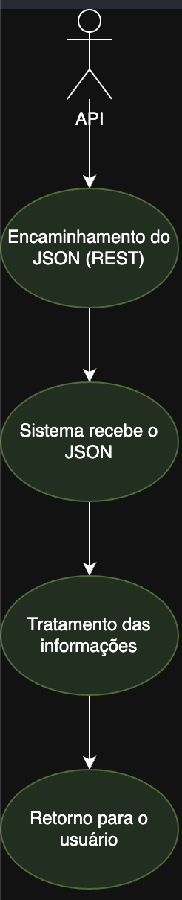
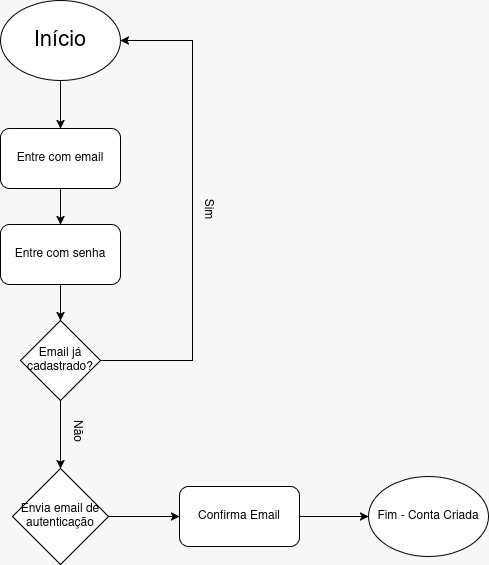

# FINTA (FINancial Tracking & Analysis)

## Domínio

Finanças

## Problema real que o FINTA resolve

Facilitar o acompanhamento de indicadores financeiros, como valor de ações, taxa selic, entre outros.

## Principais usuários

	Pessoas interessadas em acompanhar variações do mercado financeiro como um todo.

## Principais funcionalidades

- Acompanhar ações.
- Comparar taxas de financiamento.
- Autenticação.
- Favoritos.

## CLI

Instale a CLI do Finta com:

```bash
curl -fsSL https://finta.p4cs.com.br/install.sh | bash
```

A CLI usa `https://api.finta.p4cs.com.br` por padrão. Para desenvolvimento local, execute os comandos com `FINTA_API_URL=http://localhost:8787`.

## Processos de negódio
> Identificados em [Processos-de-negocio.md](./Tópicos%20Avançados%20de%20Engenharia%20de%20Software/lab-1/Processos-de-negocio.md).

### Acompanhar ações



### Autenticação (cadastro)



## Linguagem e framework

	Backend: Node.js
	Frontend: React

## Equipe

| Nome | Papel |
|------|-------|
| Kawan Mark | Product Owner (PO) |
| Pedro Custódio | Scrum Master (SM) |
| Alexandre Pierri | Desenvolvedor |
| Lucas Roberto | Desenvolvedor |
| Gabriel Albertini | Desenvolvedor |

## Estrutura do Projeto

### Laboratórios e Entregas

- **[Lab 01 - Definição de Projeto](./Gestão%20de%20Projetos%20de%20Software/Lab01%20-%20Definicao%20de%20Projeto/)**: Lean Canvas, papéis do time e visão inicial do produto
