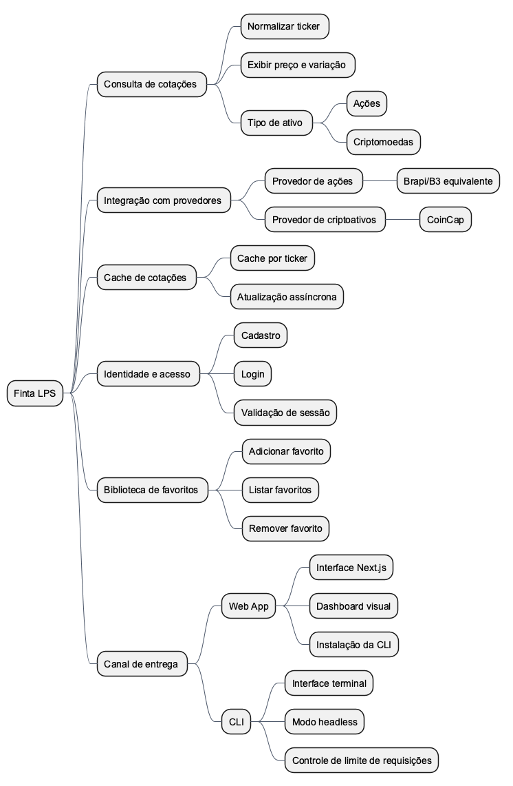
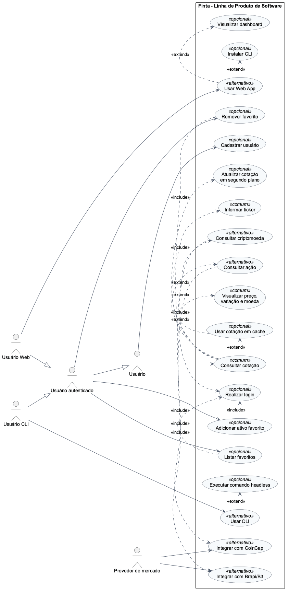

# TEMPLATE -- LABORATÓRIO LPS

## 1. Domínio do Sistema

O domínio considerado é o **Finta**, uma família de produtos para consulta, descoberta e organização de ativos financeiros, como ações e criptomoedas. A LPS permite derivar produtos com diferentes níveis de funcionalidade a partir de um núcleo comum de consulta de cotações, reaproveitando os subdomínios e bounded contexts definidos no Lab 9.

O núcleo da linha é a consulta de cotações por ticker. As variabilidades aparecem principalmente no tipo de ativo consultado, no uso de cache, na necessidade de autenticação, na presença ou ausência de uma biblioteca pessoal de favoritos e no canal de entrega do produto: Web App ou CLI.

## 2. Subdomínios

| Subdomínio | Responsabilidades | Tipo |
|---|---|---|
| Consulta de cotação de ativos | Validar e normalizar ticker, diferenciar ações e criptomoedas, consultar cotação e compor a resposta de preço, moeda, variação, volume e data de referência. | Core |
| Biblioteca de favoritos | Permitir que o usuário salve, liste e remova ativos de interesse em uma biblioteca pessoal. | Suporte |
| Identidade e acesso | Realizar cadastro, login, emissão e validação de token ou sessão para funcionalidades protegidas. | Genérico |
| Integração com provedores de mercado | Adaptar contratos de provedores externos, como Brapi/B3 equivalente e CoinCap, para o modelo interno do Finta. | Suporte |
| Cache de cotações | Armazenar snapshots de cotação por ticker para reduzir latência, custo e dependência de provedores externos. | Genérico |
| Experiência de consulta / API Orchestrator | Expor a API pública, coordenar autenticação, consulta de cotações e biblioteca de favoritos, padronizando respostas ao cliente. | Suporte |

## 3. Requisitos da LPS (comum, opcional, alternativo)

| ID | Requisito | Tipo de Feature |
|---|---|---|
| RF01 | O sistema deve permitir consultar a cotação de um ativo financeiro a partir de um ticker. | Comum |
| RF02 | O sistema deve validar e normalizar o ticker informado antes da consulta. | Comum |
| RF03 | O sistema deve exibir preço, moeda, variação diária, volume e data de referência da cotação. | Comum |
| RF04 | O sistema deve encapsular a integração com provedores externos por meio de uma camada anticorrupção. | Comum |
| RF05 | O sistema deve permitir consultar ativos do tipo ação. | Alternativo |
| RF06 | O sistema deve permitir consultar ativos do tipo criptomoeda. | Alternativo |
| RF07 | O sistema deve permitir utilizar cotação em cache quando houver snapshot válido. | Opcional |
| RF08 | O sistema deve permitir atualizar cotações expiradas em segundo plano. | Opcional |
| RF09 | O sistema deve permitir cadastro e login de usuários. | Opcional |
| RF10 | O sistema deve permitir adicionar ativos à biblioteca de favoritos do usuário autenticado. | Opcional |
| RF11 | O sistema deve permitir listar ativos favoritos do usuário autenticado. | Opcional |
| RF12 | O sistema deve permitir remover ativos da biblioteca de favoritos. | Opcional |
| RF13 | O sistema deve usar provedor de ações, como Brapi/B3 equivalente, para cotações de ações. | Alternativo |
| RF14 | O sistema deve usar provedor de criptoativos, como CoinCap, para cotações de criptomoedas. | Alternativo |
| RF15 | O sistema deve permitir derivar um produto Web App com interface visual para consulta, favoritos e dashboard. | Alternativo |
| RF16 | O sistema deve permitir derivar um produto CLI para consulta e operação por terminal. | Alternativo |
| RF17 | O sistema deve permitir execução da CLI em modo headless para automação e scripts. | Opcional |
| RF18 | O sistema deve permitir distribuir e instalar a CLI a partir do Web App. | Opcional |

## 4. Modelo de Features

{width=5.2in}

## 5. Diagrama de Casos de Uso

{width=4.6in}

## 6. Produtos da LPS

### Produto 1: Finta Web App

Produto voltado para usuários que preferem uma experiência visual no navegador. Ele reutiliza o núcleo comum de consulta de cotações e adiciona funcionalidades de identidade, favoritos, dashboard e distribuição da CLI pelo próprio frontend.

**Features incluídas:**

- Consulta de cotações por ticker.
- Validação e normalização de ticker.
- Exibição de preço, moeda, variação, volume e data de referência.
- Consulta de ações.
- Consulta de criptomoedas.
- Integração com Brapi/B3 equivalente e CoinCap.
- Cache de cotações por ticker.
- Cadastro, login e validação de sessão.
- Adicionar ativo favorito.
- Listar ativos favoritos.
- Remover ativo favorito.
- Dashboard visual com favoritos, seleções recentes e atividade.
- Canal de entrega Web App com interface Next.js.
- Distribuição/instalação da CLI pelo frontend.

### Produto 2: Finta CLI

Produto voltado para usuários técnicos ou recorrentes que desejam consultar e organizar ativos pelo terminal. Ele reutiliza os mesmos pacotes de domínio da LPS, mas seleciona o canal de entrega CLI, com comandos interativos ou headless e controle local de limite de requisições.

**Features incluídas:**

- Consulta de cotações por ticker.
- Validação e normalização de ticker.
- Exibição de preço, moeda, variação, volume e data de referência.
- Consulta de ações.
- Consulta de criptomoedas.
- Integração com Brapi/B3 equivalente e CoinCap.
- Cache de cotações por ticker.
- Atualização assíncrona de cotações expiradas.
- Cadastro, login e validação de sessão.
- Adicionar ativo favorito.
- Listar ativos favoritos.
- Remover ativo favorito.
- Dashboard em formato textual para terminal.
- Canal de entrega CLI.
- Modo headless para scripts e automações.
- Controle de limite de requisições da CLI.
