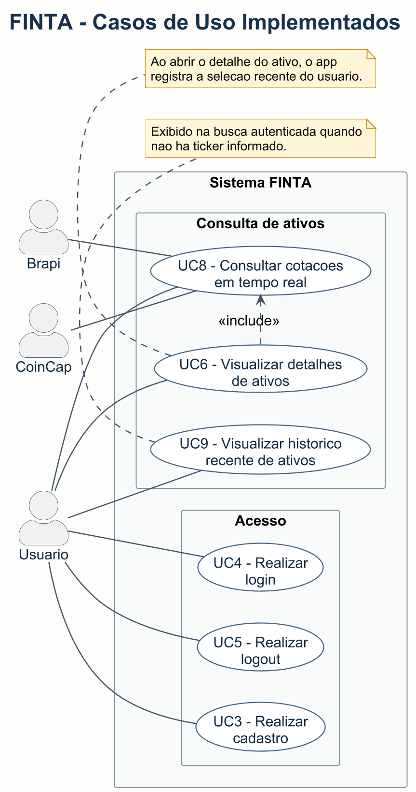
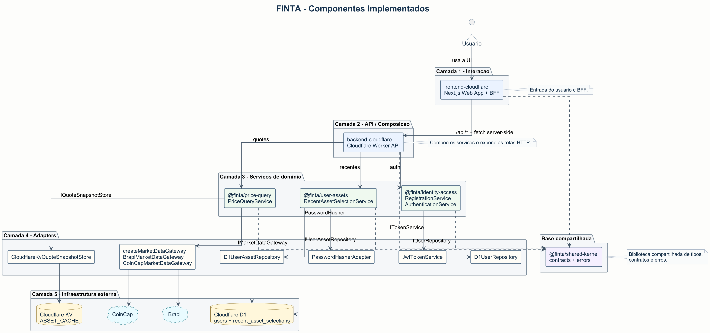

# Entrega 1 - Modelagem (Cheesman & Daniels)

## Escopo e premissas

- Escopo funcional consolidado:
  - Visualizar dashboard financeiro.
  - Visualizar detalhes de indicadores e ativos.
  - Realizar cadastro.
  - Realizar login.
  - Adicionar, editar e remover favoritos.
  - Consultar cotações em tempo real de ações e cripto.
  - Visualizar taxa Selic atualizada.
  - Listar taxas de financiamento.
  - Simular financiamento, visualizar simulações salvas e removê-las.
- Ator primário: `Usuário`.
- Sistemas externos:
  - `Brapi`.
  - `CoinCap`.
- Persistência implementada:
  - `Cloudflare D1` para `users` e `recent_asset_selections`.
  - `Cloudflare KV` (binding `ASSET_CACHE`) para cache de cotações.
- Arquitetura implementada:
  - `frontend-cloudflare (Next.js)`.
  - `backend-cloudflare (Cloudflare Workers + D1 + KV)`.
  - `@finta/identity-access`.
  - `@finta/price-query`.
  - `@finta/user-assets`.
  - `@finta/shared-kernel`.
- Premissa de modelagem:
  - as correções desta revisão refletem apenas o que está implementado hoje no código do monorepo; itens de backlog não são considerados nas seções corrigidas.
- Link do Git:
  - <https://github.com/p4cs-974/projeto-finta>

## 1) Diagrama de Casos de Uso

Arquivo fonte: [casos-de-uso-finta.puml](./diagrams/casos-de-uso-finta.puml)

## 2) Descrição dos Casos de Uso principais

### UC-03 - Realizar cadastro

- Objetivo: criar conta e iniciar sessão autenticada.
- Atores: `Usuário` (primário).
- Pré-condições:
  - nome, email e senha informados em formato válido.
- Fluxo principal:
  1. O usuário preenche o formulário de cadastro.
  2. O frontend envia a requisição para `/api/auth/register`.
  3. O backend valida o payload.
  4. O `RegistrationService` verifica se o email já existe.
  5. A senha é protegida por hash.
  6. O usuário é persistido no D1.
  7. O token JWT é emitido.
  8. O frontend grava o cookie de sessão e redireciona para a área autenticada.
- Fluxos alternativos:
  - payload inválido: erro de validação;
  - email já utilizado: rejeição com erro de negócio;
  - falha de persistência: erro técnico padronizado.
- Pós-condições:
  - conta criada com identificador único;
  - sessão autenticada disponível ao frontend.

### UC-05 - Adicionar favoritos

- Objetivo: salvar um ativo na biblioteca permanente do usuário.
- Atores: `Usuário` (primário), `API Financeira`, `API Cripto` (secundários).
- Pré-condições:
  - usuário autenticado;
  - ativo identificado corretamente;
  - repositório de favoritos disponível.
- Fluxo principal:
  1. O usuário visualiza um ativo e clica em favoritar.
  2. O frontend envia `addFavorite`.
  3. O componente `Favorites` usa `IAssetQuery` para validar símbolo, tipo e metadados.
  4. O sistema verifica duplicidade.
  5. O favorito é persistido com vínculo ao usuário.
  6. O sistema confirma a operação e invalida o resumo do dashboard.
- Fluxos alternativos:
  - ativo já favoritado: retorno idempotente com mensagem de aviso;
  - ativo inexistente: operação rejeitada;
  - falha de persistência: favorito não é confirmado.
- Pós-condições:
  - favorito salvo sem duplicidade;
  - listagem de favoritos apta para reconsulta.

### UC-08 - Consultar cotações em tempo real

- Objetivo: consultar cotações de ações e cripto com suporte a cache.
- Atores: `Usuário` (primário), `Brapi`, `CoinCap` (secundários).
- Pré-condições:
  - usuário autenticado;
  - símbolo informado em formato válido.
- Fluxo principal:
  1. O usuário pesquisa ou seleciona um ativo.
  2. O frontend consulta resultados em cache para navegação rápida.
  3. Ao abrir o detalhe, solicita `getLiveQuote`.
  4. O `PriceQueryService` procura a cotação no KV.
  5. Se não houver cache, consulta `Brapi` ou `CoinCap` e grava o snapshot.
  6. Se o cache estiver expirado, retorna o último valor e agenda refresh em segundo plano.
  7. O frontend exibe preço, variação, origem e horário da cotação.
  8. O `RecentAssetSelectionService` atualiza o histórico recente do usuário em `recent_asset_selections`.
- Fluxos alternativos:
  - ticker inválido: erro de validação;
  - ativo não encontrado: retorno de negócio;
  - provider indisponível: erro técnico padronizado.
- Pós-condições:
  - cotação exibida ao usuário;
  - cache atualizado ou refresh agendado;
  - ativo recente persistido.

## 3) Interfaces de software

### 3.1 Interfaces externas fornecidas pelo FINTA

- `IRegistrationService`
  - `register(input: RegisterUserInput): Promise<AuthSessionResult>`
- `IAuthenticationService`
  - `login(input: LoginInput): Promise<AuthSessionResult>`
- `IPriceQueryService`
  - `getLiveQuote(input: QuoteRequest): Promise<QuoteWithCacheMeta>`
  - `getCachedQuote(input: QuoteRequest): Promise<QuoteWithCacheMeta | null>`
  - `searchCachedQuotes(input: QuoteSearchRequest): Promise<QuoteWithCacheMeta[]>`
- `IRecentAssetSelectionService`
  - `listRecentSelections(input: { userId: number; limit: number }): Promise<RecentAssetSelection[]>`
  - `recordSelection(input: { userId: number; asset: TrackedAssetRef }): Promise<void>`
- Endpoint BFF implementado fora dos contratos compartilhados: `POST /api/auth/logout`

### 3.2 Interfaces externas requeridas pelo FINTA

- `IMarketDataGateway`
  - `fetchQuote(input: QuoteRequest): Promise<PriceQuote>`
- Implementações concretas atuais: `BrapiMarketDataGateway` e `CoinCapMarketDataGateway`
- Composição atual: `createMarketDataGateway(...)`

### 3.3 Interfaces internas entre componentes

- `IUserRepository`
  - `existsByEmail(email: string): Promise<boolean>`
  - `createUser(input): Promise<number>`
  - `findPublicUserById(id: number): Promise<PublicUser | null>`
  - `findCredentialsByEmail(email: string): Promise<UserCredentials | null>`
- `IPasswordHasher`
  - `hash(password: string): Promise<string>`
  - `verify(password: string, passwordHash: string): Promise<boolean>`
- `ITokenService`
  - `issueAccessToken(input): Promise<{ token: string; expiresIn: number; tokenType: "Bearer" }>`
- `IQuoteSnapshotStore`
  - `get(input: QuoteRequest): Promise<QuoteCacheEntry | null>`
  - `put(entry: QuoteCacheEntry): Promise<void>`
  - `listByPrefix(input: QuoteSearchRequest): Promise<QuoteCacheEntry[]>`
  - `acquireRefreshLock(input: QuoteRequest, ttlSeconds: number): Promise<boolean>`
  - `releaseRefreshLock(input: QuoteRequest): Promise<void>`
- `IUserAssetRepository`
  - `listRecentSelections(userId: number, limit: number): Promise<RecentAssetSelection[]>`
  - `upsertRecentSelection(input): Promise<void>`
  - `trimRecentSelections(userId: number, keep: number): Promise<void>`

## 4) Identificação de Componentes

Os componentes identificados nesta revisão refletem apenas o código implementado hoje no monorepo.

- `frontend-cloudflare`
  - Responsabilidade: UI, páginas autenticadas, rotas BFF e gestão do cookie de sessão.
  - Interfaces principais: expõe `/api/auth/*`, `/api/assets/*` e `/api/users/me/recent-assets`; integra-se ao `backend-cloudflare`.
- `@finta/identity-access`
  - Responsabilidade: cadastro, login e emissão da sessão autenticada.
  - Serviços concretos: `RegistrationService` e `AuthenticationService`.
  - Interfaces principais: fornece `IRegistrationService` e `IAuthenticationService`; consome `IUserRepository`, `IPasswordHasher` e `ITokenService`.
- `@finta/price-query`
  - Responsabilidade: consulta de cotações com suporte a cache.
  - Serviço concreto: `PriceQueryService`.
  - Interfaces principais: fornece `IPriceQueryService`; consome `IMarketDataGateway` e `IQuoteSnapshotStore`.
- `@finta/user-assets`
  - Responsabilidade: gestão do histórico recente do usuário.
  - Serviço concreto: `RecentAssetSelectionService`.
  - Interfaces principais: fornece `IRecentAssetSelectionService`; consome `IUserAssetRepository`.
- `backend-cloudflare`
  - Responsabilidade: adapters HTTP, adapters D1/KV e gateways externos.
  - Interfaces principais: integra `RegistrationService`, `AuthenticationService`, `PriceQueryService` e `RecentAssetSelectionService` com `D1UserRepository`, `D1UserAssetRepository`, `CloudflareKvQuoteSnapshotStore`, `BrapiMarketDataGateway` e `CoinCapMarketDataGateway`.

## 5) Contratos das Operações (pré e pós-condições)

### 5.1 frontend-cloudflare

- Operações implementadas: `POST /api/auth/register`, `POST /api/auth/login`, `POST /api/auth/logout`, `GET /api/assets/search`, `GET /api/assets/[ticker]`, `GET /api/assets/[ticker]/cache`, `GET /api/users/me/recent-assets` e `POST /api/users/me/recent-assets`
- Pré-condições:
  - URL base do `backend-cloudflare` configurada;
  - rotas BFF habilitadas;
  - cookie de sessão presente nas operações autenticadas.
- Pós-condições:
  - requisições encaminhadas ao `backend-cloudflare`;
  - rotas de autenticação sincronizam o cookie de sessão;
  - `POST /api/auth/logout` remove o cookie autenticado.

### 5.2 @finta/identity-access

- Operação: `RegistrationService.register(input: RegisterUserInput)`
- Pré-condições:
  - `input.name`, `input.email` e `input.password` válidos;
  - `existsByEmail(input.email)` igual a `false`.
- Pós-condições:
  - usuário persistido com identificador único;
  - token de acesso emitido;
  - sessão autenticada retornada ao frontend.
- Operação: `AuthenticationService.login(input: LoginInput)`
- Pré-condições:
  - `input.email` e `input.password` válidos;
  - `findCredentialsByEmail(input.email)` retorna um usuário.
- Pós-condições:
  - credenciais validadas;
  - token de acesso emitido;
  - sessão autenticada retornada ao frontend.

### 5.3 @finta/price-query

- Operação: `PriceQueryService.getLiveQuote(input: QuoteRequest)`
- Pré-condições:
  - `input.symbol` válido para o `assetType`;
  - `IMarketDataGateway` disponível;
  - `IQuoteSnapshotStore` configurado.
- Pós-condições:
  - cotação retornada em `QuoteWithCacheMeta`;
  - snapshot salvo ou reaproveitado do cache;
  - refresh assíncrono agendado quando o cache estiver obsoleto.

### 5.4 @finta/user-assets

- Operação: `RecentAssetSelectionService.recordSelection(input: { userId: number; asset: TrackedAssetRef })`
- Pré-condições:
  - usuário autenticado;
  - ativo informado em formato válido;
  - `IUserAssetRepository` disponível.
- Pós-condições:
  - seleção registrada em `recent_asset_selections`;
  - histórico recente ajustado ao limite configurado.
- Operação: `RecentAssetSelectionService.listRecentSelections(input: { userId: number; limit: number })`
- Pré-condições:
  - usuário autenticado;
  - `limit` positivo;
  - `IUserAssetRepository` disponível.
- Pós-condições:
  - histórico recente do usuário retornado em ordem decrescente de seleção.

## 6) Dependências entre Componentes (via interfaces)

- `frontend-cloudflare` -> rotas BFF `POST /api/auth/register`, `POST /api/auth/login`, `POST /api/auth/logout`, `GET /api/assets/search`, `GET /api/assets/[ticker]`, `GET /api/assets/[ticker]/cache`, `GET /api/users/me/recent-assets` e `POST /api/users/me/recent-assets`
- `frontend-cloudflare` -> `backend-cloudflare` via `/auth/register`, `/auth/login`, `/users/me/recent-assets`, `/ativos/cache-search`, `/ativos/:ticker` e `/ativos/:ticker/cache`
- `backend-cloudflare` -> `RegistrationService`
- `backend-cloudflare` -> `AuthenticationService`
- `backend-cloudflare` -> `PriceQueryService`
- `backend-cloudflare` -> `RecentAssetSelectionService`
- `RegistrationService` -> `IUserRepository`, `IPasswordHasher`, `ITokenService`
- `AuthenticationService` -> `IUserRepository`, `IPasswordHasher`, `ITokenService`
- `PriceQueryService` -> `IMarketDataGateway`, `IQuoteSnapshotStore`
- `RecentAssetSelectionService` -> `IUserAssetRepository`
- `backend-cloudflare` -> `BrapiMarketDataGateway`, `CoinCapMarketDataGateway`, `D1UserRepository`, `D1UserAssetRepository`, `CloudflareKvQuoteSnapshotStore`

## 7) Diagrama de Componentes (PlantUML)

Arquivo fonte: [diagrama-final-consolidado.puml](./diagrams/diagrama-final-consolidado.puml)
