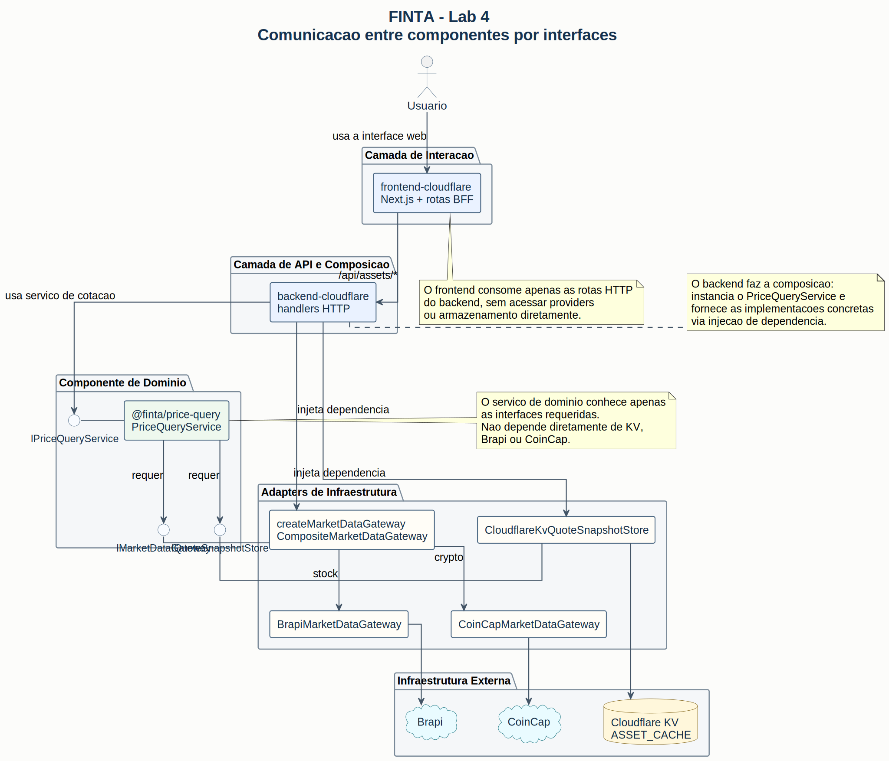

# Lab 4 - Componentes Implementados e Comunicação por Interfaces

## Dois componentes analisados nesta entrega

1. `@finta/price-query`
2. `backend-cloudflare`, especificamente a camada de adapters usada para mercado e cache

Esse par foi escolhido porque evidencia o uso de:

- interface fornecida pelo serviço de domínio;
- interfaces requeridas para acesso à infraestrutura;
- classes concretas que implementam essas interfaces;
- injeção de dependência na composição do backend.

## Diagrama PlantUML



## Descrição dos dois componentes implementados

### 1. `@finta/price-query`

É o componente de domínio responsável por consultar cotações de ações e criptoativos. Sua classe principal é `PriceQueryService`, que concentra as regras de negócio para:

- buscar cotação em cache;
- consultar um provider externo quando não há cache;
- marcar o cache como obsoleto quando necessário;
- agendar atualização assíncrona em segundo plano;
- devolver a resposta padronizada com metadados de cache.

Esse componente não conhece detalhes de Cloudflare KV, Brapi ou CoinCap. Ele trabalha apenas com contratos.

### 2. `backend-cloudflare` (adapters de mercado e cache)

É o componente que faz a composição entre o serviço de domínio e a infraestrutura real do sistema. Para o caso de consulta de cotações, ele concentra:

- os handlers HTTP que recebem as requisições;
- a seleção do provider correto de mercado;
- o acesso ao cache no Cloudflare KV;
- a ligação entre o `PriceQueryService` e os recursos concretos do ambiente.

As classes e pontos de composição mais relevantes são:

- `CloudflareKvQuoteSnapshotStore`
- `BrapiMarketDataGateway`
- `CoinCapMarketDataGateway`
- `createMarketDataGateway`
- `handleGetLiveQuote`
- `handleGetCachedQuote`
- `handleSearchCachedQuotes`

## Interfaces fornecidas

### Interfaces fornecidas por `@finta/price-query`

O componente fornece a interface `IPriceQueryService`, implementada pela classe `PriceQueryService`, com as operações:

- `getLiveQuote(input: QuoteRequest): Promise<QuoteWithCacheMeta>`
- `getCachedQuote(input: QuoteRequest): Promise<QuoteWithCacheMeta | null>`
- `searchCachedQuotes(input: QuoteSearchRequest): Promise<QuoteWithCacheMeta[]>`

### Interfaces fornecidas por `backend-cloudflare`

Para o restante do sistema, o backend expõe as interfaces HTTP que materializam esse componente em produção e localmente:

- `GET /ativos/cache-search`
- `GET /ativos/:ticker`
- `GET /ativos/:ticker/cache`
- `GET /ativos/:ticker/stream`

Essas rotas são a forma como o frontend consome o serviço de cotação.

## Interfaces requeridas

### Interfaces requeridas por `@finta/price-query`

O componente depende das seguintes interfaces:

- `IMarketDataGateway`
  - `fetchQuote(input: QuoteRequest): Promise<PriceQuote>`
- `IQuoteSnapshotStore`
  - `get(input: QuoteRequest): Promise<QuoteCacheEntry | null>`
  - `put(entry: QuoteCacheEntry): Promise<void>`
  - `listByPrefix(input: QuoteSearchRequest): Promise<QuoteCacheEntry[]>`
  - `acquireRefreshLock(input: QuoteRequest, ttlSeconds: number): Promise<boolean>`
  - `releaseRefreshLock(input: QuoteRequest): Promise<void>`

### Classes que implementam essas interfaces

- `BrapiMarketDataGateway` implementa `IMarketDataGateway` para ações.
- `CoinCapMarketDataGateway` implementa `IMarketDataGateway` para criptoativos.
- `CompositeMarketDataGateway`, criado por `createMarketDataGateway(...)`, decide qual gateway concreto usar conforme o tipo do ativo.
- `CloudflareKvQuoteSnapshotStore` implementa `IQuoteSnapshotStore` usando o binding `ASSET_CACHE` do Cloudflare KV.

Nesta configuração, o componente cliente dessas interfaces é o próprio `PriceQueryService`, que utiliza apenas os contratos `IMarketDataGateway` e `IQuoteSnapshotStore`, sem depender das classes concretas.

## Explicação de como ocorre a comunicação entre eles

1. O usuário interage com o frontend em `https://finta.p4cs.com.br` ou, localmente, em `http://localhost:3000`.
2. O frontend chama suas rotas BFF em `/api/assets/*`.
3. Essas rotas encaminham a requisição para o `backend-cloudflare`, em `https://api.finta.p4cs.com.br` ou, localmente, em `http://127.0.0.1:8787`.
4. O handler HTTP do backend valida autenticação, interpreta o símbolo e o tipo do ativo e instancia `PriceQueryService`.
5. Nessa instanciação, o backend injeta dependências concretas que satisfazem `IMarketDataGateway` e `IQuoteSnapshotStore`.
6. O `PriceQueryService` consulta primeiro o cache. Se não houver snapshot, chama `fetchQuote(...)` no gateway de mercado. Se o cache estiver obsoleto, devolve o valor em cache e agenda atualização assíncrona.
7. O resultado volta ao backend no formato `QuoteWithCacheMeta`, é serializado em JSON e retornado ao frontend.
8. O frontend renderiza a cotação sem acessar diretamente KV, Brapi ou CoinCap.

## Justificativa de como foi evitado o acoplamento direto

O acoplamento direto foi evitado principalmente entre a lógica de negócio de cotações e a infraestrutura externa.

- `PriceQueryService` não importa nem depende diretamente de `BrapiMarketDataGateway`, `CoinCapMarketDataGateway` ou `CloudflareKvQuoteSnapshotStore`.
- O serviço depende apenas das abstrações `IMarketDataGateway` e `IQuoteSnapshotStore`.
- As implementações concretas ficam isoladas no `backend-cloudflare`, que funciona como camada de composição.
- A troca de provider de mercado ou de mecanismo de cache pode ser feita substituindo adapters, sem reescrever a regra de negócio do componente de cotação.
- A injeção de dependência ocorre no momento em que o backend cria o `PriceQueryService`, passando objetos compatíveis com as interfaces esperadas.
- O frontend também permanece desacoplado da infraestrutura, porque consome apenas rotas HTTP do backend e tipos compartilhados do monorepo.

## Instruções para execução do projeto

### Produção

- Aplicação web: [https://finta.p4cs.com.br](https://finta.p4cs.com.br)
- API: [https://api.finta.p4cs.com.br](https://api.finta.p4cs.com.br)
- Documentação da API: [https://api.finta.p4cs.com.br/docs](https://api.finta.p4cs.com.br/docs)

### Execução local no Windows

#### Pré-requisitos

- Node.js LTS instalado
- Git instalado

O projeto usa `pnpm@10.17.1`, mas não é necessário instalá-lo manualmente antes. O ideal é habilitá-lo com o `corepack`, que já acompanha o Node.js LTS.

#### Passo a passo

1. Abra o PowerShell na raiz do repositório.
2. Habilite o Corepack:

```powershell
corepack enable
corepack prepare pnpm@10.17.1 --activate
```

3. Instale as dependências do monorepo:

```powershell
pnpm install
```

4. Configure os segredos do backend:

```powershell
cd apps/backend-cloudflare
Copy-Item .dev.example .dev.vars
```

5. Edite o arquivo `apps/backend-cloudflare/.dev.vars` e preencha:

```dotenv
BRAPI_TOKEN=seu_token_brapi
COINCAP_API_KEY=sua_chave_coincap
```

6. Volte para a raiz do projeto:

```powershell
cd ../..
```

7. Inicie frontend e backend ao mesmo tempo:

```powershell
pnpm run dev
```

8. Acesse:

- frontend local: [http://localhost:3000](http://localhost:3000)
- backend local: [http://127.0.0.1:8787](http://127.0.0.1:8787)
- docs locais da API: [http://127.0.0.1:8787/docs](http://127.0.0.1:8787/docs)

### Execução local no macOS/Linux

#### Pré-requisitos

- Node.js LTS instalado
- Git instalado

#### Passo a passo

1. Abra um terminal na raiz do repositório.
2. Habilite o Corepack:

```bash
corepack enable
corepack prepare pnpm@10.17.1 --activate
```

3. Instale as dependências:

```bash
pnpm install
```

4. Configure os segredos do backend:

```bash
cd apps/backend-cloudflare
cp .dev.example .dev.vars
```

5. Edite `apps/backend-cloudflare/.dev.vars` com:

```dotenv
BRAPI_TOKEN=seu_token_brapi
COINCAP_API_KEY=sua_chave_coincap
```

6. Volte para a raiz:

```bash
cd ../..
```

7. Inicie o ambiente local:

```bash
pnpm run dev
```

8. Acesse:

- frontend local: [http://localhost:3000](http://localhost:3000)
- backend local: [http://127.0.0.1:8787](http://127.0.0.1:8787)
- docs locais da API: [http://127.0.0.1:8787/docs](http://127.0.0.1:8787/docs)

#### Observações

- Sem credenciais válidas para os providers externos, apenas o fluxo estrutural da aplicação sobe; as consultas reais de mercado continuarão dependentes de `Brapi` e `CoinCap`.
