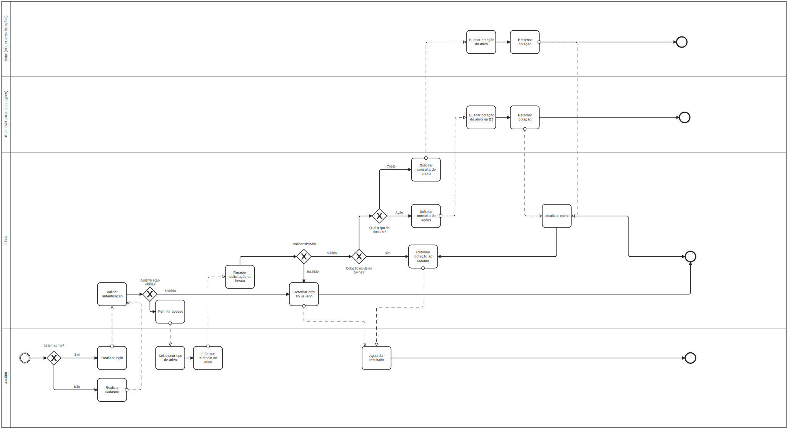
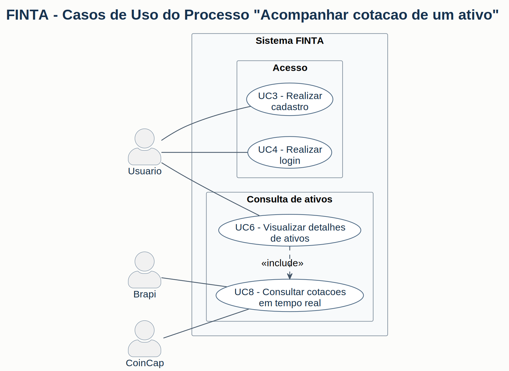

# Entrega - Lab 5

## Processo de Negocio Escolhido

- Nome do processo:
  Consulta de Cotacao de Ativos (Acoes e Criptomoedas)
  

- Objetivo do processo:
  Permitir que usuarios autenticados consultem cotacoes atualizadas de acoes negociadas na B3 e de criptomoedas por meio de provedores externos, com uso de cache para reduzir latencia e chamadas desnecessarias.
  

- Justificativa da escolha:
  O processo e central para a proposta do FINTA, pois conecta autenticacao, validacao, integracao com APIs externas, uso de cache e apresentacao de dados financeiros em tempo quase real.
  

- Gatilho de inicio:
  Usuario autenticado seleciona o tipo do ativo e informa o ticker para consulta.
  

- Resultado esperado:
  Exibicao da cotacao formatada do ativo, com informacao de origem dos dados (cache ou provedor) e timestamp da atualizacao, ou retorno de erro adequado quando houver falha.
  

## Atores do Processo

- Ator principal:
  Usuario autenticado
  

- Participantes internos:
  Sistema FINTA (frontend e backend em Cloudflare Workers)
  

- Sistemas externos:
  Provedores de cotacoes de acoes (Yahoo Finance ou Brapi), provedores de cotacoes de cripto (CoinGecko ou Binance), Redis para cache distribuido e PostgreSQL/Cloudflare D1 para persistencia de dados.
  

## Entradas e Saidas do Processo

### Entradas

- Tipo de ativo selecionado pelo usuario (acao ou cripto)
- Ticker informado pelo usuario
- Token JWT no header Authorization
- Requisicao HTTP para consulta da cotacao

### Saidas

- Cotacao formatada no padrao da API FINTA
- Indicacao da fonte dos dados (cache ou provedor externo)
- Timestamp da ultima atualizacao
- Mensagens de erro HTTP apropriadas (400, 401, 503 ou 404)

## Diagrama BPMN do Processo TO-BE

## Descricao das Atividades do Processo

### Atividade 01

- Nome:
  Selecionar tipo do ativo
  

- Descricao:
  Usuario escolhe se deseja consultar uma acao da B3 ou uma criptomoeda pela interface do sistema.
  

- Responsavel:
  Usuario
  

- Entradas:
  Opcao de consulta disponivel na interface
  

- Saidas:
  Tipo de ativo selecionado
  

### Atividade 02

- Nome:
  Informar ticker
  

- Descricao:
  Usuario digita o codigo do ativo que deseja consultar, como PETR4, VALE3, BTC ou ETH.
  

- Responsavel:
  Usuario
  

- Entradas:
  Campo de texto para ticker
  

- Saidas:
  Ticker informado
  

### Atividade 03

- Nome:
  Receber solicitacao e validar autenticacao
  

- Descricao:
  O backend recebe a requisicao HTTP, extrai o token JWT do header Authorization e valida se o usuario esta autenticado.
  

- Responsavel:
  Sistema FINTA
  

- Entradas:
  Tipo de ativo, ticker e token JWT
  

- Saidas:
  Requisicao autenticada ou erro 401
  

### Atividade 04

- Nome:
  Validar ticker
  

- Descricao:
  O sistema verifica se o ticker possui formato valido e se corresponde a um ativo negociavel segundo as regras de negocio.
  

- Responsavel:
  Sistema FINTA
  

- Entradas:
  Ticker informado pelo usuario
  

- Saidas:
  Ticker validado ou erro 400
  

### Atividade 05

- Nome:
  Consultar cache interno
  

- Descricao:
  O sistema busca a cotacao no cache interno para reutilizar dados recentes e evitar chamadas desnecessarias aos provedores externos.
  

- Responsavel:
  Sistema FINTA
  

- Entradas:
  Tipo de ativo e ticker validados
  

- Saidas:
  Cotacao em cache, quando disponivel, ou indicacao de cache vazio/expirado
  

### Atividade 06

- Nome:
  Consultar provedor externo, atualizar cache e retornar resposta
  

- Descricao:
  Quando nao ha cache valido, o sistema consulta o provedor externo adequado ao tipo de ativo, valida a resposta, atualiza o cache, formata os dados e devolve a cotacao ao usuario.
  

- Responsavel:
  Sistema FINTA com apoio dos provedores externos
  

- Entradas:
  Tipo de ativo, ticker validado e eventual ausencia de cache valido
  

- Saidas:
  Cotacao formatada ao usuario ou erro 503/404 em caso de falha do provedor
  

## Regras de Negocio

- RN01:
  Apenas usuarios autenticados podem consultar cotacoes de ativos.
  

- RN02:
  O ticker deve conter apenas letras e numeros, com tamanho entre 3 e 10 caracteres.
  

- RN03:
  Apenas ativos negociados oficialmente na B3 ou reconhecidos em exchanges podem ser consultados.
  

- RN04:
  Cotacoes de acoes podem permanecer em cache por ate 5 minutos; cotacoes de criptomoedas, por ate 1 minuto.
  

- RN05:
  Cotacoes de acoes refletem valores atualizados apenas durante o horario de pregao da B3; fora desse periodo, deve ser exibido o ultimo fechamento.
  

## Diagrama de Casos de Uso

Arquivo fonte PlantUML: [./diagrams/casos-de-uso-acompanhar-cotacao.puml](./diagrams/casos-de-uso-acompanhar-cotacao.puml)

## Casos de Uso Relacionados ao Processo

### UC01

- Nome:
  Realizar Login
  

- Objetivo:
  Autenticar o usuario para liberar acesso as funcionalidades de consulta de cotacao.
  

- Atores:
  Usuario nao autenticado
  

- Pre-condicoes:
  Usuario possui conta cadastrada no sistema.
  

- Pos-condicoes:
  Usuario autenticado com token JWT valido armazenado no cliente.
  

### UC02

- Nome:
  Criar Conta
  

- Objetivo:
  Permitir o cadastro de um novo usuario e autentica-lo no sistema.
  

- Atores:
  Usuario nao autenticado
  

- Pre-condicoes:
  Email ainda nao cadastrado no sistema.
  

- Pos-condicoes:
  Conta criada com sucesso e usuario autenticado.
  

### UC03

- Nome:
  Consultar Cotacao de Ativo
  

- Objetivo:
  Permitir a consulta de cotacoes de acoes ou criptomoedas com validacao, uso de cache e integracao com provedores externos.
  

- Atores:
  Usuario autenticado e Sistema FINTA
  

- Pre-condicoes:
  Usuario possui token JWT valido e informa um ticker para consulta.
  

- Pos-condicoes:
  Cotacao exibida na interface ou mensagem de erro apropriada retornada ao usuario.
  

## Requisitos Nao Funcionais

- RNF01:
  O tempo de resposta nao deve ultrapassar 2 segundos em 95% das consultas servidas por cache e 5 segundos quando houver consulta a provedor externo.
  

- RNF02:
  O sistema deve manter disponibilidade mensal minima de 99,5% durante o horario comercial.
  

- RNF03:
  O processo deve ser resiliente a falhas de provedores externos, com retry, fallback e registro de falhas.
  

- RNF04:
  A autenticacao deve ser segura, com JWT, senhas com BCrypt, comunicacao HTTPS e rate limiting.
  

- RNF05:
  A arquitetura deve suportar escalabilidade horizontal com backend stateless, cache centralizado e balanceamento de carga.
  

## Observacoes Finais

- Link do Git com as atualizacoes do projeto:
  https://github.com/p4cs-974/projeto-finta.git
  
