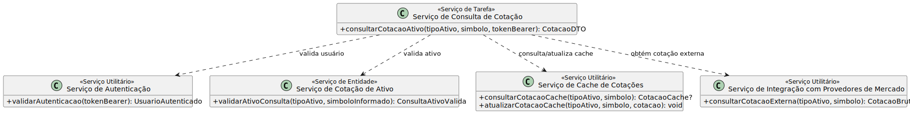

# Entrega - Lab 6

## Processo de Negócio Escolhido

- Nome do processo:
  Consulta de Cotação de Ativos (Ações e Criptomoedas)

- Objetivo do documento:
  Identificar, agrupar e descrever os serviços candidatos necessários para suportar o processo TO-BE de Consulta de Cotação de Ativos (Ações e Criptomoedas), detalhando as operações do sistema, sua classificação e a lógica de execução de cada serviço.

- Autores:
  Kawan Mark; Pedro Custódio; Alexandre Pierri; Lucas Roberto; Gabriel Albertini

- Data de emissão:
  08/04/2026

## Identificação de Operações Candidatas

| Tarefa do Processo To-Be | Operação Candidata |
|---|---|
| Receber solicitação e validar autenticação | `validarAutenticacao(tokenBearer)` |
| Validar ticker | `validarAtivoConsulta(tipoAtivo, simboloInformado)` |
| Consultar cache interno | `consultarCotacaoCache(tipoAtivo, simbolo)` |
| Consultar provedor externo, atualizar cache e retornar resposta | `consultarCotacaoExterna(tipoAtivo, simbolo)` |
| Consultar provedor externo, atualizar cache e retornar resposta | `atualizarCotacaoCache(tipoAtivo, simbolo, cotacao)` |
| Consultar provedor externo, atualizar cache e retornar resposta | `consultarCotacaoAtivo(tipoAtivo, simbolo, tokenBearer)` |

## Serviços Candidatos Identificados

As operações candidatas foram agrupadas por entidade e contexto lógico, considerando a separação entre regras do domínio, utilidades transversais e a orquestração do processo de negócio.

### Agrupamento das operações por entidade e contexto lógico

| Contexto lógico | Operações agrupadas | Serviço candidato | Classificação |
|---|---|---|---|
| Acesso e segurança | `validarAutenticacao` | Serviço de Autenticação | Serviço utilitário |
| Entidade cotação de ativo | `validarAtivoConsulta` | Serviço de Cotação de Ativo | Serviço de entidade |
| Gerenciamento de cache | `consultarCotacaoCache`; `atualizarCotacaoCache` | Serviço de Cache de Cotações | Serviço utilitário |
| Integração externa | `consultarCotacaoExterna` | Serviço de Integração com Provedores de Mercado | Serviço utilitário |
| Orquestração do processo | `consultarCotacaoAtivo` | Serviço de Consulta de Cotação | Serviço de tarefa |

### Representação em diagramas UML com PlantUML

O diagrama de classes foi definido em PlantUML e renderizado em SVG na pasta `diagramas/`.

- Fonte PlantUML: `diagramas/servicos-candidatos-classe.puml`
- Renderização SVG: `diagramas/servicos-candidatos-classe.svg`

## Descrição de Serviços

### Serviço de Autenticação

- Objetivo:
  Garantir que apenas usuários autenticados possam iniciar a consulta de cotação.

- Operação:
  `validarAutenticacao(tokenBearer)`

- Dados de entrada:
  Cabeçalho `Authorization` no formato `Bearer JWT`.

- Dados de saída:
  Contexto do usuário autenticado ou erro `401 INVALID_TOKEN`.

- Descrição da lógica:
  1. Extrair o cabeçalho `Authorization` da requisição.
  2. Validar se o esquema informado é `Bearer`.
  3. Verificar assinatura, integridade e validade temporal do JWT.
  4. Retornar o contexto do usuário autenticado para o fluxo de consulta.
  5. Em caso de falha, interromper o processo com resposta `401`.

### Serviço de Cotação de Ativo

- Objetivo:
  Centralizar as regras da entidade cotação de ativo para normalização e validação da consulta.

- Operação:
  `validarAtivoConsulta(tipoAtivo, simboloInformado)`

- Dados de entrada:
  Tipo do ativo selecionado e ticker ou símbolo informado pelo usuário.

- Dados de saída:
  Ativo normalizado e validado, ou erro `422 VALIDATION_ERROR`.

- Descrição da lógica:
  1. Receber o tipo do ativo e o símbolo informado pelo usuário.
  2. Definir a categoria padrão adequada quando o tipo não for explicitamente informado.
  3. Normalizar a entrada, removendo espaços e convertendo o símbolo para caixa alta.
  4. Validar o padrão do ticker conforme as regras da B3 ou do mercado de criptoativos.
  5. Retornar a consulta validada para continuidade do processo.

### Serviço de Cache de Cotações

- Objetivo:
  Reaproveitar cotações recentes para reduzir latência e chamadas desnecessárias aos provedores externos.

- Operação:
  `consultarCotacaoCache(tipoAtivo, simbolo)`

- Dados de entrada:
  Tipo do ativo e símbolo já validados.

- Dados de saída:
  Cotação encontrada em cache com metadados de atualização, ou indicação de `cache miss`/expiração.

- Descrição da lógica:
  1. Construir a chave de cache conforme o tipo do ativo consultado.
  2. Buscar a cotação no armazenamento de cache.
  3. Caso não exista registro, retornar `cache miss`.
  4. Caso exista registro, verificar se a cotação ainda está dentro da política de validade.
  5. Retornar a cotação e o estado do cache para o serviço orquestrador.

### Serviço de Cache de Cotações

- Objetivo:
  Persistir a cotação mais recente para futuras consultas do mesmo ativo.

- Operação:
  `atualizarCotacaoCache(tipoAtivo, simbolo, cotacao)`

- Dados de entrada:
  Tipo do ativo, símbolo consultado e cotação retornada pelo provedor externo.

- Dados de saída:
  Registro de cache criado ou atualizado com timestamp da atualização.

- Descrição da lógica:
  1. Receber a cotação válida retornada pela integração externa.
  2. Montar a estrutura de cache com chave padronizada, dados do ativo e data de atualização.
  3. Persistir o registro no armazenamento de cache.
  4. Disponibilizar a informação atualizada para consultas subsequentes.

### Serviço de Integração com Provedores de Mercado

- Objetivo:
  Obter a cotação atualizada do ativo em provedores externos compatíveis com o tipo consultado.

- Operação:
  `consultarCotacaoExterna(tipoAtivo, simbolo)`

- Dados de entrada:
  Tipo do ativo e símbolo já normalizados e validados.

- Dados de saída:
  Cotação normalizada do ativo, ou erro `404 ASSET_NOT_FOUND` / `502 EXTERNAL_SERVICE_ERROR`.

- Descrição da lógica:
  1. Selecionar o provedor externo adequado ao tipo do ativo.
  2. Enviar requisição HTTP para o provedor correspondente.
  3. Validar a resposta recebida e mapear os dados para o formato interno da aplicação.
  4. Tratar o caso de ativo inexistente com erro de negócio apropriado.
  5. Tratar indisponibilidade, timeout ou falha externa com erro de integração.

### Serviço de Consulta de Cotação

- Objetivo:
  Orquestrar todo o processo de consulta e devolver ao usuário a cotação formatada do ativo.

- Operação:
  `consultarCotacaoAtivo(tipoAtivo, simbolo, tokenBearer)`

- Dados de entrada:
  Token de autenticação, tipo do ativo e ticker ou símbolo informado pelo usuário.

- Dados de saída:
  Cotação formatada com indicação de origem dos dados e timestamp de atualização, ou erros `401`, `422`, `404` e `502`.

- Descrição da lógica:
  1. Invocar o Serviço de Autenticação para validar o usuário solicitante.
  2. Invocar o Serviço de Cotação de Ativo para normalizar e validar o símbolo consultado.
  3. Consultar o Serviço de Cache de Cotações.
  4. Se houver cotação válida em cache, devolver a resposta imediatamente.
  5. Caso contrário, consultar o Serviço de Integração com Provedores de Mercado.
  6. Atualizar o cache com a cotação recém-obtida.
  7. Montar e retornar a resposta final ao usuário.
