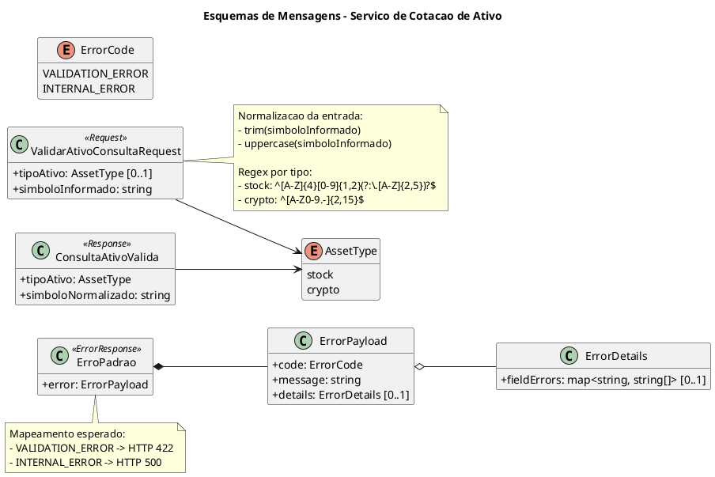
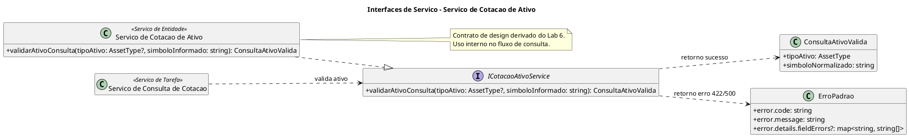

# Lab 07 - Documento de Contratos de Servicos

## Servico selecionado

- Nome do servico: **Servico de Cotacao de Ativo**
- Classificacao: **Servico de Entidade**
- Origem (Lab 6): operacao `validarAtivoConsulta(tipoAtivo, simboloInformado)`
- Objetivo do servico: centralizar a normalizacao e validacao do ativo consultado (acao B3 ou criptoativo) para continuidade do fluxo de cotacao.

## 1. Especificar os Esquemas de Mensagens

Para este item, o diagrama e opcional. Nesta entrega, ele foi incluido para deixar o contrato mais claro.

### 1.1 Diagrama de mensagens (PlantUML)



### 1.2 Mensagem de entrada (requisicao)

**Nome:** `ValidarAtivoConsultaRequest`

| Campo                | Tipo       | Obrigatorio | Descricao                                                                              |
| -------------------- | ---------- | ----------- | -------------------------------------------------------------------------------------- |
| `tipoAtivo`        | `string` | Nao         | Tipo do ativo:`stock` ou `crypto`. Se ausente, o fluxo considera padrao `stock`. |
| `simboloInformado` | `string` | Sim         | Simbolo/ticker informado pelo usuario.                                                 |

Exemplo:

```json
{
  "tipoAtivo": "stock",
  "simboloInformado": " petr4 "
}
```

### 1.3 Mensagem de saida (resposta de sucesso)

**Nome:** `ConsultaAtivoValida`

| Campo                  | Tipo       | Obrigatorio | Descricao                                                       |
| ---------------------- | ---------- | ----------- | --------------------------------------------------------------- |
| `tipoAtivo`          | `string` | Sim         | Tipo final aplicado na validacao (`stock` ou `crypto`).     |
| `simboloNormalizado` | `string` | Sim         | Simbolo normalizado e validado para uso no servico de consulta. |

Exemplo:

```json
{
  "tipoAtivo": "stock",
  "simboloNormalizado": "PETR4"
}
```

### 1.4 Mensagem de erro

**Nome:** `ErroPadrao`

| Campo                         | Tipo       | Obrigatorio | Descricao                                                    |
| ----------------------------- | ---------- | ----------- | ------------------------------------------------------------ |
| `error.code`                | `string` | Sim         | Codigo do erro (`VALIDATION_ERROR` ou `INTERNAL_ERROR`). |
| `error.message`             | `string` | Sim         | Descricao textual da falha.                                  |
| `error.details.fieldErrors` | `object` | Nao         | Erros de validacao por campo, quando aplicavel.              |

Exemplo:

```json
{
  "error": {
    "code": "VALIDATION_ERROR",
    "message": "Ticker do ativo invalido"
  }
}
```

## 2. Especificar as Interfaces dos Servicos (obrigatorio com diagrama)

### 2.1 Diagrama de interface (PlantUML)




### 2.2 Contrato textual da interface

| Interface                | Operacao                 | Parametros de entrada                                   | Retorno                 |
| ------------------------ | ------------------------ | ------------------------------------------------------- | ----------------------- |
| `ICotacaoAtivoService` | `validarAtivoConsulta` | `tipoAtivo?: AssetType`, `simboloInformado: string` | `ConsultaAtivoValida` |

Erros previstos na operacao:

- `422 VALIDATION_ERROR`
- `500 INTERNAL_ERROR`

## 3. Definicao de Politicas

### 3.1 Seguranca

- O servico de cotacao de ativo e **interno** e nao e exposto diretamente ao cliente final.
- O fluxo pressupoe chamada autenticada a montante (JWT validado no servico orquestrador).

### 3.2 Autenticacao e autorizacao

- A autenticacao nao e feita dentro deste servico; ela ocorre no servico de autenticacao/consulta.
- Autorizacao de acesso ao servico: consumo restrito ao servico orquestrador de consulta.

### 3.3 Controle de acesso e restricoes de uso

- Campos obrigatorios de negocio: `simboloInformado`.
- Normalizacao obrigatoria: `trim + uppercase`.
- Validacao obrigatoria por regex conforme tipo do ativo.
- Em falha de validacao, retorno imediato `422 VALIDATION_ERROR`.

### 3.4 Rastreabilidade e logs

- Registrar tentativa de validacao com tipo e resultado (`sucesso`/`erro`).
- Nao registrar token, senha ou dados sensiveis.

## 4. Definicao de SLA (Service Level Agreement)

| Indicador                        | Meta                      |
| -------------------------------- | ------------------------- |
| Disponibilidade mensal           | >= 99,5%                  |
| Tempo de resposta esperado (p95) | <= 50 ms                  |
| Tempo de resposta esperado (p99) | <= 120 ms                 |
| Capacidade de atendimento        | >= 1000 validacoes/minuto |
| Taxa de erro interna (5xx)       | <= 0,5% ao mes            |

### 4.1 Comportamento em caso de falhas

- Falha de formato/validacao: responder com `422 VALIDATION_ERROR`.
- Falha inesperada interna: responder com `500 INTERNAL_ERROR`.
- Como nao ha dependencia externa direta no servico, nao ha politica de retry local.

## 5. Consolidacao da transicao Analise -> Design

- Este contrato detalha o servico identificado no Lab 6, mantendo operacao e regras centrais.
- O documento consolida a fase de design com:
  - interface formal,
  - esquemas de mensagens,
  - politicas de operacao,
  - metas de SLA.
