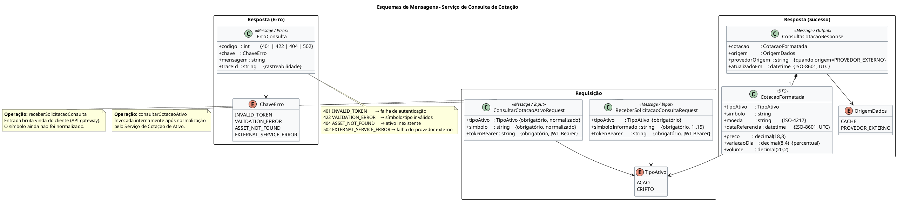
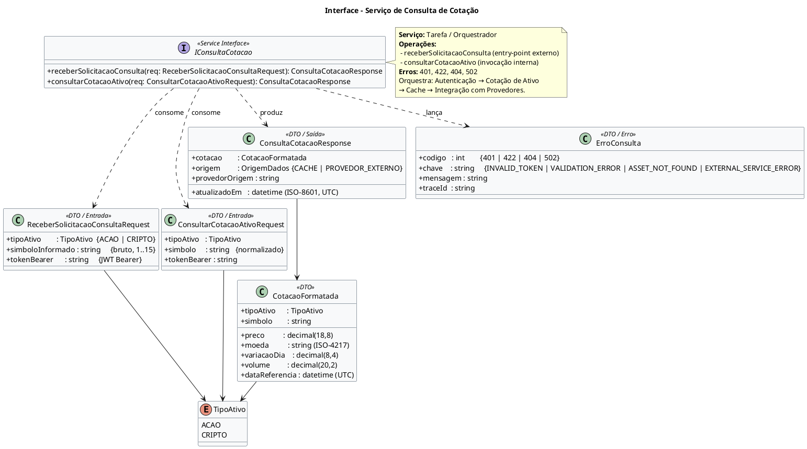

# Contrato de Serviço — Serviço de Consulta de Cotação

**Projeto:** Consulta de Cotação de Ativos (Ações e Criptomoedas)
**Serviço:** Consulta de Cotação
**Tipo:** Serviço de Tarefa (orquestrador do processo de consulta)
**Autor:** Gabriel Albertini
**Data de emissão:** 15/04/2026

---

## Objetivo do Serviço

Receber a solicitação do usuário e orquestrar todo o processo de consulta até devolver a cotação formatada do ativo. Este é o serviço **entry-point** do fluxo TO-BE de Consulta de Cotação: coordena autenticação, validação do ativo, consulta em cache, acionamento do provedor externo (via Serviço de Integração com Provedores de Mercado), atualização do cache e padronização de erros.

Operações expostas:
- `receberSolicitacaoConsulta(tipoAtivo, simboloInformado, tokenBearer)` — entry-point externo.
- `consultarCotacaoAtivo(tipoAtivo, simbolo, tokenBearer)` — invocação interna após normalização.

---

## 1. Esquemas de Mensagens

Os esquemas de entrada, saída de sucesso e saída de erro das operações do serviço estão representados no diagrama de classes UML abaixo (fonte em `mensagens.puml`):



As tabelas a seguir detalham os campos, tipos e regras de cada mensagem.

### 1.1 Mensagem de Requisição — `ReceberSolicitacaoConsultaRequest`

Entry-point externo. Corresponde à requisição bruta vinda do cliente (web/mobile), ainda sem normalização do símbolo.

| Campo              | Tipo                    | Obrigatório | Regras / Observações                                  |
|--------------------|-------------------------|-------------|-------------------------------------------------------|
| `tipoAtivo`        | `enum { ACAO, CRIPTO }` | Sim         | Tipo selecionado pelo usuário.                        |
| `simboloInformado` | `string`                | Sim         | Ticker/símbolo bruto informado, 1..15 caracteres.     |
| `tokenBearer`      | `string`                | Sim         | JWT no cabeçalho `Authorization: Bearer <token>`.     |

Exemplo (JSON):
```json
{ "tipoAtivo": "ACAO", "simboloInformado": " petr4 " }
```
com header `Authorization: Bearer eyJhbGciOi...`.

### 1.2 Mensagem de Requisição — `ConsultarCotacaoAtivoRequest`

Operação interna invocada **após** a normalização pelo Serviço de Cotação de Ativo.

| Campo         | Tipo                    | Obrigatório | Regras / Observações                                  |
|---------------|-------------------------|-------------|-------------------------------------------------------|
| `tipoAtivo`   | `enum { ACAO, CRIPTO }` | Sim         | Já validado pelo Serviço de Cotação de Ativo.         |
| `simbolo`     | `string`                | Sim         | Normalizado: uppercase, sem espaços, 1..15 chars.     |
| `tokenBearer` | `string`                | Sim         | JWT Bearer — propagado do caller.                     |

### 1.3 Mensagem de Resposta (sucesso) — `ConsultaCotacaoResponse`

| Campo            | Tipo                           | Descrição                                                                  |
|------------------|--------------------------------|----------------------------------------------------------------------------|
| `cotacao`        | `CotacaoFormatada`             | Objeto com os dados de cotação formatados para o cliente.                  |
| `origem`         | `enum { CACHE, PROVEDOR_EXTERNO }` | Indica se a resposta veio do cache ou de consulta ao provedor.         |
| `provedorOrigem` | `string`                       | Identificador do provedor (preenchido quando `origem=PROVEDOR_EXTERNO`).   |
| `atualizadoEm`   | `datetime` (ISO-8601, UTC)     | Timestamp da última atualização da cotação.                                |

**Subtipo `CotacaoFormatada`:**

| Campo            | Tipo               | Descrição                                            |
|------------------|--------------------|------------------------------------------------------|
| `tipoAtivo`      | `enum`             | `ACAO` ou `CRIPTO`.                                  |
| `simbolo`        | `string`           | Símbolo consultado, caixa alta.                      |
| `preco`          | `decimal(18,8)`    | Preço corrente.                                      |
| `moeda`          | `string` (ISO-4217)| Moeda de referência (ex: `BRL`, `USD`).              |
| `variacaoDia`    | `decimal(8,4)`     | Variação percentual do dia.                          |
| `volume`         | `decimal(20,2)`    | Volume negociado.                                    |
| `dataReferencia` | `datetime` (UTC)   | Timestamp da cotação reportado pelo provedor.        |

Exemplo (JSON):
```json
{
  "cotacao": {
    "tipoAtivo": "ACAO",
    "simbolo": "PETR4",
    "preco": 38.27000000,
    "moeda": "BRL",
    "variacaoDia": 1.2350,
    "volume": 128934000.00,
    "dataReferencia": "2026-04-15T17:45:00Z"
  },
  "origem": "PROVEDOR_EXTERNO",
  "provedorOrigem": "B3_API",
  "atualizadoEm": "2026-04-15T17:45:03Z"
}
```

### 1.4 Mensagem de Resposta (erro) — `ErroConsulta`

| Campo      | Tipo     | Valores                                                                                     | Descrição                                          |
|------------|----------|---------------------------------------------------------------------------------------------|----------------------------------------------------|
| `codigo`   | `int`    | `401`, `422`, `404`, `502`                                                                  | Código HTTP mapeado.                               |
| `chave`    | `string` | `INVALID_TOKEN`, `VALIDATION_ERROR`, `ASSET_NOT_FOUND`, `EXTERNAL_SERVICE_ERROR`            | Identificador interno.                             |
| `mensagem` | `string` | —                                                                                           | Mensagem amigável ao cliente.                      |
| `traceId`  | `string` | —                                                                                           | Identificador de rastreamento W3C Trace Context.   |

Mapeamento de erros:
- **401 `INVALID_TOKEN`** — token ausente, expirado ou inválido (originado pelo Serviço de Autenticação).
- **422 `VALIDATION_ERROR`** — símbolo/tipo inválidos (originado pelo Serviço de Cotação de Ativo).
- **404 `ASSET_NOT_FOUND`** — ativo inexistente no provedor.
- **502 `EXTERNAL_SERVICE_ERROR`** — falha/timeout do provedor externo.

---

## 2. Interface do Serviço

A interface está representada no diagrama UML abaixo (fonte em `interface.puml`):



**Operações expostas:**

| Operação                     | Parâmetros de entrada                                           | Retorno (sucesso)          | Retorno (erro)                                     |
|------------------------------|-----------------------------------------------------------------|----------------------------|----------------------------------------------------|
| `receberSolicitacaoConsulta` | `tipoAtivo`, `simboloInformado`, `tokenBearer`                  | `ConsultaCotacaoResponse`  | `401`, `422`, `404`, `502`                         |
| `consultarCotacaoAtivo`      | `tipoAtivo`, `simbolo` (normalizado), `tokenBearer`             | `ConsultaCotacaoResponse`  | `401`, `422`, `404`, `502`                         |

**Estilo:** REST/JSON síncrono. `receberSolicitacaoConsulta` é exposto publicamente via API Gateway; `consultarCotacaoAtivo` é interno.

**Endpoints lógicos sugeridos:**
- `POST /api/v1/cotacoes/consultas` (externo — mapeia para `receberSolicitacaoConsulta`)
- `POST /internal/v1/consulta-cotacao/consultar` (interno — mapeia para `consultarCotacaoAtivo`)

**Dependências (serviços invocados):**
1. Serviço de Autenticação — validação do token e autorização.
2. Serviço de Cotação de Ativo — normalização e validação do símbolo.
3. Serviço de Cache de Cotações — leitura/escrita de cotações recentes.
4. Serviço de Integração com Provedores de Mercado — consulta ao provedor externo em caso de cache miss.
5. Serviço de Resposta de Erro — padronização de falhas.

---

## 3. Políticas

### 3.1 Segurança
- Comunicação externa exclusivamente via **HTTPS (TLS 1.2+)**; internamente **mTLS** na malha de serviços.
- Cabeçalho `Authorization: Bearer <JWT>` obrigatório no entry-point externo.
- **CORS** restrito aos domínios oficiais do frontend.
- **Propagação** do `traceId`/`spanId` (W3C Trace Context) em todas as chamadas downstream.
- **Não** armazena credenciais, senhas ou tokens em logs.

### 3.2 Autenticação
- Toda requisição externa deve conter JWT Bearer válido.
- Validação delegada ao **Serviço de Autenticação** (`validarAutenticacao(tokenBearer)`).
- Tokens expirados ou inválidos → `401 INVALID_TOKEN`.

### 3.3 Autorização e controle de acesso
- Qualquer usuário autenticado pode consultar cotações (sem RBAC adicional nesta versão).
- O endpoint interno (`consultarCotacaoAtivo`) só aceita invocação de serviços autorizados na malha (identidade por service account / SPIFFE ID).
- Chamadas sem autenticação → `401`.

### 3.4 Restrições de uso
- **Rate limiting por usuário:** 60 req/min; excedente recebe `429 TOO_MANY_REQUESTS`.
- **Rate limiting por IP:** 300 req/min como proteção contra abuso.
- **Tamanho máximo do payload:** 2 KB (requisição leve).
- **Cache first:** o serviço sempre consulta o cache antes de acionar o provedor externo, respeitando a política de validade do cache.
- **Idempotência:** operações são naturalmente idempotentes (leitura); requisições repetidas retornam a mesma cotação enquanto o cache estiver válido.
- **Logs** de auditoria com: `userId` (do JWT), `tipoAtivo`, `simbolo`, `origem`, `latência`, `status` — sem dados sensíveis do token.

### 3.5 Conformidade
- Nenhum dado pessoal (PII) além do `userId` extraído do token é manipulado.
- Observabilidade ponta-a-ponta obrigatória (tracing distribuído).

---

## 4. SLA (Service Level Agreement)

### 4.1 Disponibilidade
| Indicador                 | Meta                                                        |
|---------------------------|-------------------------------------------------------------|
| Disponibilidade mensal    | **99,9%** (~43min de indisponibilidade/mês aceitáveis)      |
| Janela de manutenção      | Domingos, 02:00–04:00 BRT (não contabilizada no SLA)        |

Por ser o serviço entry-point do fluxo, a meta é mais rigorosa que a das dependências individuais. Degradações parciais (ex.: provedor externo indisponível, servindo apenas via cache) **não** contam como indisponibilidade.

### 4.2 Tempo de resposta (end-to-end)
| Percentil | Cache hit   | Cache miss (com chamada a provedor) |
|-----------|-------------|-------------------------------------|
| p50       | ≤ 120 ms    | ≤ 700 ms                            |
| p95       | ≤ 300 ms    | ≤ 2.000 ms                          |
| p99       | ≤ 500 ms    | ≤ 3.500 ms                          |

Medido entre o recebimento da requisição HTTP no serviço e o envio da resposta ao cliente.

### 4.3 Capacidade de atendimento (throughput)
- **Projetado:** 500 req/s sustentadas no cluster; **pico:** 1.200 req/s por até 60s.
- **Escala horizontal:** autoscaling por CPU (>65%), latência p95 (>500ms) ou fila (>100 req).
- **Dimensionamento mínimo:** 3 réplicas em zonas de disponibilidade distintas.

### 4.4 Comportamento em caso de falha
| Cenário                                                  | Comportamento esperado                                                                                                         |
|----------------------------------------------------------|--------------------------------------------------------------------------------------------------------------------------------|
| Token inválido                                           | `401 INVALID_TOKEN` imediato (sem acionar demais serviços).                                                                    |
| Símbolo/tipo inválidos                                   | `422 VALIDATION_ERROR` retornado pelo Serviço de Cotação de Ativo.                                                             |
| Cache hit                                                | Resposta imediata com `origem=CACHE`.                                                                                          |
| Cache miss + provedor OK                                 | Resposta com `origem=PROVEDOR_EXTERNO`; cache atualizado de forma assíncrona/opcional.                                         |
| Cache miss + provedor indisponível                       | `502 EXTERNAL_SERVICE_ERROR` delegado ao Serviço de Resposta de Erro.                                                          |
| Cache miss + provedor com ativo inexistente              | `404 ASSET_NOT_FOUND`.                                                                                                         |
| Provedor lento (> timeout)                               | Retentativa única com backoff; se persistir, `502`.                                                                            |
| Falha do Serviço de Cache                                | Fallback: tenta direto o provedor externo; cache é best-effort, não bloqueia a resposta ao cliente.                            |
| Falha do Serviço de Autenticação                         | `503 SERVICE_UNAVAILABLE` com Retry-After; incidente SEV-2 (bloqueia todo o fluxo).                                            |
| Falha do Serviço de Resposta de Erro                     | Resposta de fallback hardcoded com `codigo=500`, `chave=INTERNAL_ERROR`; registrar alerta.                                     |

### 4.5 Métricas e observabilidade
- Dashboards: latência p50/p95/p99 por operação, taxa de erro por código, taxa de cache hit, throughput.
- Alertas:
  - Taxa de erro > 2% em 5 min → **SEV-3**
  - Taxa de erro > 10% em 5 min → **SEV-2**
  - p95 > 2× meta por 10 min → **SEV-3**
  - Cache hit ratio < 40% por 15 min → investigar (aviso, não alerta)
- Logs com retenção de **30 dias**; traces distribuídos com retenção de **7 dias**.

### 4.6 Penalidades e revisão
- SLA revisado trimestralmente.
- Quedas abaixo de 99,5% de disponibilidade mensal geram post-mortem em até 5 dias úteis.

---

## Referências

- Lab 6 — *Análise de Serviços* (documento base com os serviços candidatos identificados).
- Lab 1 — *Processo TO-BE de Consulta de Cotação de Ativos*.
