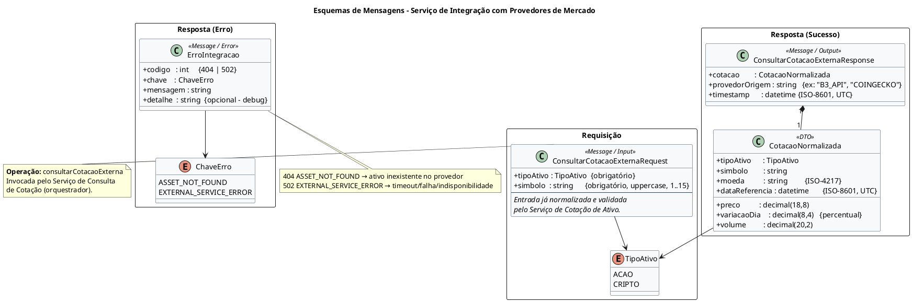
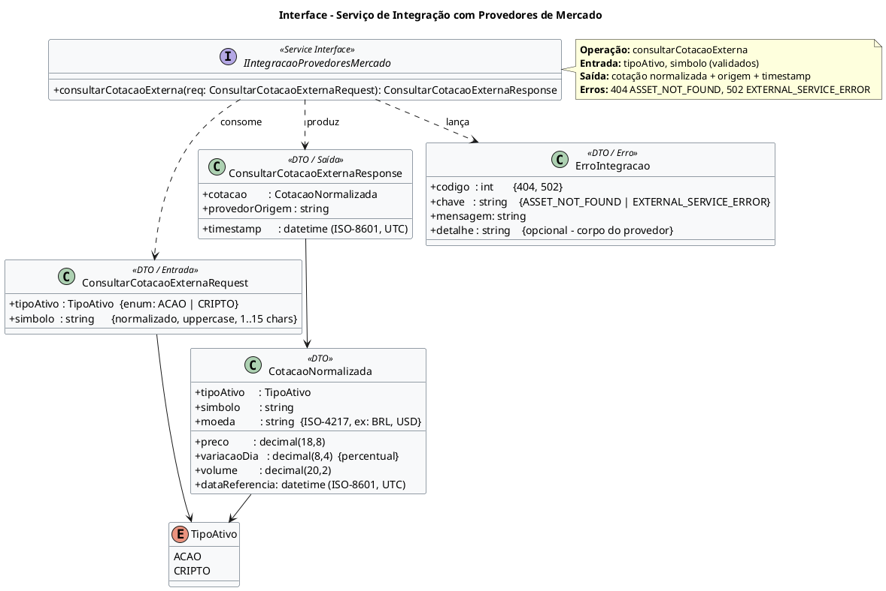

# Contrato de Serviço — Serviço de Integração com Provedores de Mercado

**Projeto:** Consulta de Cotação de Ativos (Ações e Criptomoedas)
**Serviço:** Integração com Provedores de Mercado
**Tipo:** Serviço Utilitário (fachada para provedores externos)
**Autor:** Gabriel Albertini
**Data de emissão:** 15/04/2026

---

## Objetivo do Serviço

Obter a cotação atualizada do ativo em provedores externos compatíveis com o tipo consultado (ações via B3/provedor equivalente; criptomoedas via provedor de cripto). O serviço encapsula a heterogeneidade dos provedores externos e devolve uma cotação normalizada ao serviço orquestrador (Consulta de Cotação), isolando falhas de integração da camada de negócio.

Operação exposta: `consultarCotacaoExterna(tipoAtivo, simbolo)`

---

## 1. Esquemas de Mensagens

Os esquemas de entrada, saída de sucesso e saída de erro da operação `consultarCotacaoExterna` estão representados no diagrama de classes UML abaixo (fonte em `mensagens.puml`):



As tabelas a seguir detalham os campos, tipos e regras de cada mensagem.

### 1.1 Mensagem de Requisição — `ConsultarCotacaoExternaRequest`

Invocada pelo Serviço de Consulta de Cotação já com os dados previamente normalizados e validados pelo Serviço de Cotação de Ativo.

| Campo       | Tipo                    | Obrigatório | Regras / Observações                                             |
|-------------|-------------------------|-------------|------------------------------------------------------------------|
| `tipoAtivo` | `enum { ACAO, CRIPTO }` | Sim         | Determina o provedor externo a ser acionado.                     |
| `simbolo`   | `string`                | Sim         | Ticker normalizado em caixa alta, sem espaços, 1..15 caracteres. |

Exemplo (JSON):
```json
{
  "tipoAtivo": "ACAO",
  "simbolo": "PETR4"
}
```

### 1.2 Mensagem de Resposta (sucesso) — `ConsultarCotacaoExternaResponse`

| Campo            | Tipo                 | Descrição                                                        |
|------------------|----------------------|------------------------------------------------------------------|
| `cotacao`        | `CotacaoNormalizada` | Objeto com os dados de cotação no formato interno da aplicação.  |
| `provedorOrigem` | `string`             | Identificador textual do provedor utilizado (ex: `"B3_API"`).    |
| `timestamp`      | `datetime` (ISO-8601, UTC) | Instante em que a resposta foi produzida pelo serviço.     |

**Subtipo `CotacaoNormalizada`:**

| Campo            | Tipo               | Descrição                                                    |
|------------------|--------------------|--------------------------------------------------------------|
| `tipoAtivo`      | `enum`             | `ACAO` ou `CRIPTO`.                                          |
| `simbolo`        | `string`           | Símbolo consultado, em caixa alta.                           |
| `preco`          | `decimal(18,8)`    | Preço corrente do ativo.                                     |
| `moeda`          | `string` (ISO-4217)| Moeda de referência do preço (ex: `BRL`, `USD`).             |
| `variacaoDia`    | `decimal(8,4)`     | Variação percentual do dia.                                  |
| `volume`         | `decimal(20,2)`    | Volume negociado no período de referência.                   |
| `dataReferencia` | `datetime` (UTC)   | Timestamp da cotação conforme reportado pelo provedor.       |

Exemplo (JSON):
```json
{
  "cotacao": {
    "tipoAtivo": "ACAO",
    "simbolo": "PETR4",
    "preco": 38.27000000,
    "moeda": "BRL",
    "variacaoDia": 1.2350,
    "volume": 128934000.00,
    "dataReferencia": "2026-04-15T17:45:00Z"
  },
  "provedorOrigem": "B3_API",
  "timestamp": "2026-04-15T17:45:03Z"
}
```

### 1.3 Mensagem de Resposta (erro) — `ErroIntegracao`

| Campo      | Tipo     | Valores                                           | Descrição                                            |
|------------|----------|---------------------------------------------------|------------------------------------------------------|
| `codigo`   | `int`    | `404`, `502`                                      | Código HTTP mapeado.                                 |
| `chave`    | `string` | `ASSET_NOT_FOUND`, `EXTERNAL_SERVICE_ERROR`       | Identificador interno do erro.                       |
| `mensagem` | `string` | —                                                 | Mensagem amigável para o consumidor do serviço.      |
| `detalhe`  | `string` | opcional                                          | Corpo/trecho do erro do provedor externo (debug).    |

Exemplo:
```json
{ "codigo": 404, "chave": "ASSET_NOT_FOUND", "mensagem": "Ativo PETR99 não encontrado no provedor." }
```

---

## 2. Interface do Serviço

A interface do serviço está representada no diagrama UML abaixo (gerado em PlantUML — fonte em `interface.puml`, render em `InterfaceIntegracaoProvedoresMercado.png`):



**Operações expostas:**

| Operação                  | Parâmetros de entrada                | Retorno (sucesso)                     | Retorno (erro)                               |
|---------------------------|--------------------------------------|---------------------------------------|----------------------------------------------|
| `consultarCotacaoExterna` | `tipoAtivo: TipoAtivo`, `simbolo: string` | `ConsultarCotacaoExternaResponse` | `404 ASSET_NOT_FOUND` / `502 EXTERNAL_SERVICE_ERROR` |

**Estilo:** REST/JSON internamente à malha de serviços (invocação síncrona pelo Serviço de Consulta de Cotação). Não exposta diretamente ao cliente final.

**Endpoint lógico sugerido:** `POST /internal/v1/integracao-mercado/cotacao`

---

## 3. Políticas

### 3.1 Segurança
- Comunicação interna exclusivamente via **TLS 1.2+** (mTLS na malha de serviços).
- Credenciais dos provedores externos (API keys, tokens) armazenadas em **cofre de segredos** (ex.: HashiCorp Vault / AWS Secrets Manager), nunca em código ou variáveis de ambiente versionadas.
- Rotação de segredos a cada 90 dias ou imediatamente em caso de incidente.

### 3.2 Autenticação
- O serviço **não autentica o usuário final** (essa responsabilidade é do Serviço de Autenticação, invocado previamente pelo orquestrador).
- O serviço **é autenticado pelos provedores externos** via API key/token específico de cada provedor.
- Chamadas ao serviço só são aceitas se originadas de dentro da VPC/malha interna (política de rede `service-mesh-only`).

### 3.3 Autorização e controle de acesso
- Apenas o **Serviço de Consulta de Cotação** tem permissão para invocar a operação `consultarCotacaoExterna` (autorização por identidade de serviço — SPIFFE ID ou service account).
- Nenhuma exposição pública; chamadas externas devem ser rejeitadas com `403 FORBIDDEN`.

### 3.4 Restrições de uso
- Entrada obrigatoriamente pré-validada pelo Serviço de Cotação de Ativo; o serviço **não re-normaliza** o símbolo.
- **Rate limiting:** máximo 100 req/s por instância consumidora, alinhado aos limites contratados dos provedores externos.
- **Circuit breaker:** abre após 5 falhas consecutivas de provedor em janela de 30s; meio-aberto após 60s.
- **Timeout** de chamada ao provedor externo: 3s para ações, 5s para criptomoedas.
- **Não persiste** dados — cache é responsabilidade do Serviço de Cache de Cotações.
- **Logs** de requisição/resposta obrigatórios, porém **sem** expor tokens ou respostas brutas sensíveis dos provedores (apenas metadados: provedor, latência, status).

### 3.5 Conformidade
- Nenhum dado pessoal (PII) é manipulado pelo serviço.
- Observabilidade: todo request propaga `traceId` e `spanId` via cabeçalhos W3C Trace Context.

---

## 4. SLA (Service Level Agreement)

### 4.1 Disponibilidade
| Indicador                 | Meta                                                     |
|---------------------------|----------------------------------------------------------|
| Disponibilidade mensal    | **99,5%** (~3h39min de indisponibilidade/mês aceitáveis) |
| Janela de manutenção      | Domingos, 02:00–04:00 BRT (não contabilizada no SLA)     |

A disponibilidade aqui refere-se à capacidade do serviço de **responder** (seja com sucesso ou com erro padronizado `502 EXTERNAL_SERVICE_ERROR`); a disponibilidade de dados depende dos provedores externos e é tratada como dependência.

### 4.2 Tempo de resposta
| Percentil | Ações (B3) | Criptomoedas |
|-----------|------------|--------------|
| p50       | ≤ 400 ms   | ≤ 600 ms     |
| p95       | ≤ 1.500 ms | ≤ 2.500 ms   |
| p99       | ≤ 3.000 ms | ≤ 5.000 ms   |

Medido entre o recebimento da requisição pelo serviço e a emissão da resposta ao orquestrador, já descontado o tempo de resposta do provedor externo quando este exceder o timeout.

### 4.3 Capacidade de atendimento (throughput)
- **Projetado:** 200 req/s sustentadas por instância; **pico:** 500 req/s por até 60s.
- **Escala horizontal:** autoscaling por CPU (>70%) e fila de espera (>50 req).
- **Limite global:** respeitar o teto contratado junto a cada provedor externo (ex.: B3 = 5.000 req/min agregado).

### 4.4 Comportamento em caso de falha
| Cenário                                              | Comportamento esperado                                                                                         |
|------------------------------------------------------|----------------------------------------------------------------------------------------------------------------|
| Ativo não existe no provedor                         | Retornar `404 ASSET_NOT_FOUND` (erro de negócio, não conta como indisponibilidade).                            |
| Timeout do provedor externo                          | Após o timeout configurado, retornar `502 EXTERNAL_SERVICE_ERROR`. Uma retentativa automática com backoff exponencial (máx. 1 tentativa adicional, 500ms). |
| Circuit breaker aberto                               | Retornar imediatamente `502 EXTERNAL_SERVICE_ERROR` sem chamar o provedor; métrica `circuit_open_total++`.     |
| Falha de rede intermitente                           | Retentativa única; se persistir, retornar `502` e registrar alerta.                                            |
| Indisponibilidade total do provedor (>5 min)         | Alerta `SEV-2` ao time de plantão; orquestrador passa a servir do cache até expiração.                         |
| Erro de contrato (resposta malformada do provedor)   | Registrar incidente, retornar `502`, não propagar o payload bruto.                                             |

### 4.5 Métricas e observabilidade
- Dashboards: latência p50/p95/p99, taxa de erro por provedor, estado do circuit breaker, uso de cota do provedor.
- Alertas:
  - Taxa de erro > 5% em 5 min → **SEV-3**
  - Taxa de erro > 20% em 5 min → **SEV-2**
  - Circuit breaker aberto > 2 min → **SEV-2**
- Logs com retenção de **30 dias** em ambiente de produção.

### 4.6 Penalidades e revisão
- SLA revisado trimestralmente.
- Quedas abaixo de 99% de disponibilidade mensal geram relatório post-mortem em até 5 dias úteis.

---

## Referências

- Lab 6 — *Análise de Serviços* (documento base com os serviços candidatos identificados).
- Lab 1 — *Processo TO-BE de Consulta de Cotação de Ativos*.
