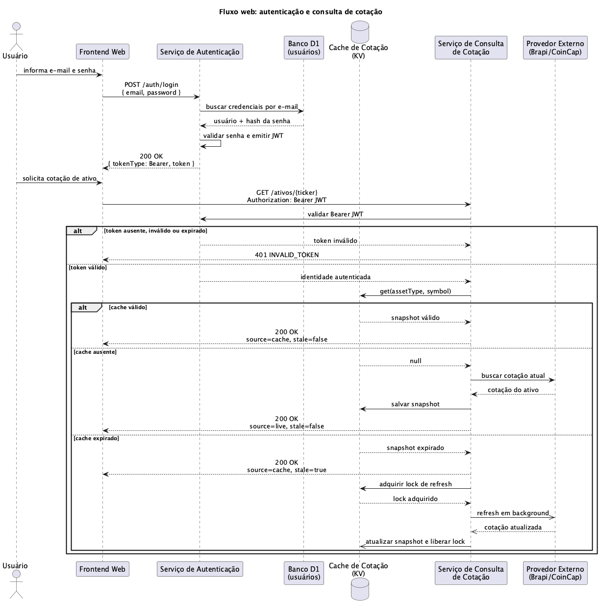
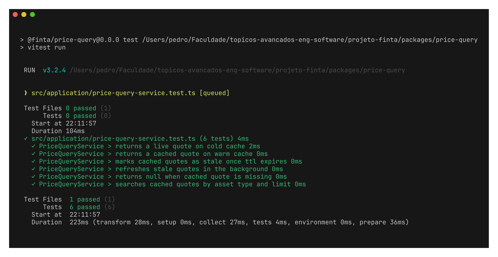
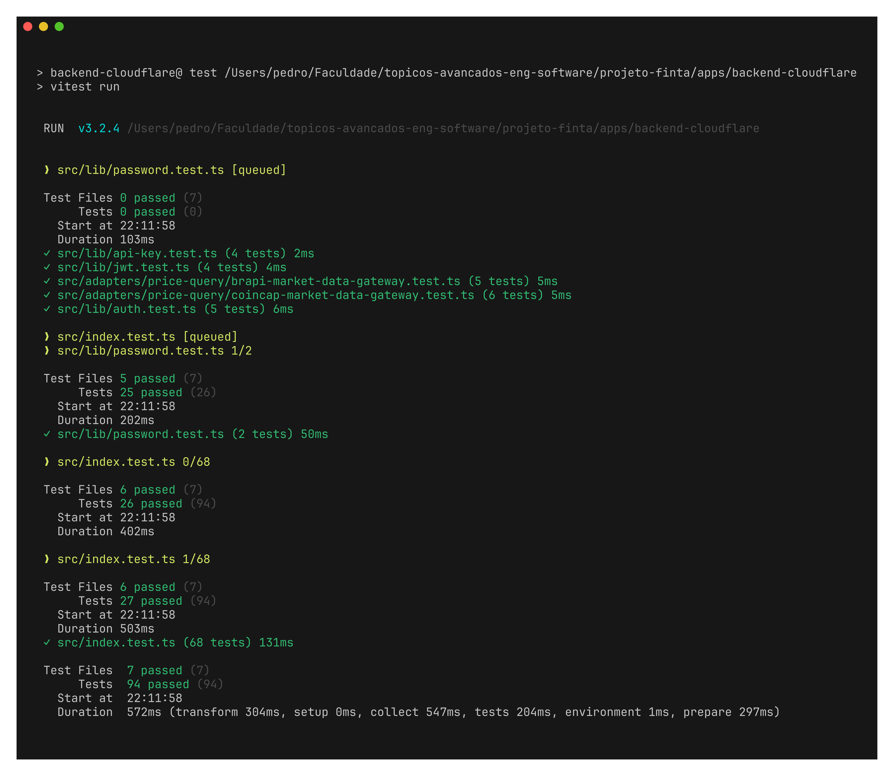

**Nome do Processo**

**Construção de Serviços**

Autores: Pedro Custódio, Alexandre Pierri, Lucas Roberto, Gabriel Albertini e Kawan Mark

Data de emissão: 29/04/2026

Revisor: Equipe FINTA

Data de revisão: 29/04/2026

# Objetivo do Documento

Este documento descreve a construção de dois serviços do sistema FINTA em uma arquitetura orientada a serviços: o **Serviço de Autenticação** e o **Serviço de Consulta de Cotação**. A entrega apresenta o estilo de coordenação adotado, o fluxo de interação entre os serviços e as estratégias de teste unitário e de integração, com evidências da execução dos testes.

# Estilo de Coordenação dos Serviços

O estilo de coordenação adotado é **orquestração síncrona**.

A escolha se justifica porque o backend controla explicitamente a sequência do fluxo. Para consultar uma cotação, o cliente primeiro precisa estar autenticado; o endpoint de cotação valida o token Bearer JWT e somente depois aciona o serviço responsável por consultar preço, cache e provedor externo. Assim, a ordem das chamadas é centralizada pelo Worker/API, e não distribuída por eventos independentes entre serviços.

Serviços e componentes envolvidos:

- **Serviço de Autenticação**: realiza login, valida credenciais e emite token Bearer JWT.
- **Serviço de Consulta de Cotação**: recebe a solicitação autenticada e retorna cotação de ação ou criptomoeda.
- **Cache de Cotação**: mantém snapshots de cotações em KV para reduzir chamadas externas.
- **Provedores Externos**: Brapi para ações e CoinCap para criptomoedas.

Fluxo principal:

1. O usuário informa e-mail e senha no frontend web.
2. O frontend envia `POST /auth/login` ao Serviço de Autenticação.
3. O Serviço de Autenticação consulta o banco D1, valida a senha e emite um Bearer JWT.
4. O frontend envia `GET /ativos/{ticker}` com `Authorization: Bearer <token>`.
5. O endpoint de cotação valida o token antes de consultar o ativo.
6. O Serviço de Consulta de Cotação verifica o cache KV.
7. Se houver cache válido, retorna a cotação em cache.
8. Se o cache estiver ausente, chama o provedor externo, salva o snapshot e retorna a cotação ao cliente.
9. Se o cache estiver expirado, retorna o snapshot stale imediatamente e agenda atualização em background.



# Estratégia de Teste

A estratégia de testes foi dividida entre teste unitário e teste de integração. O teste unitário foca a lógica interna do Serviço de Consulta de Cotação. O teste de integração valida a comunicação entre Autenticação e Consulta de Cotação no backend.

## Tipo de Teste: Teste Unitário

**Serviço testado:** Serviço de Consulta de Cotação (`@finta/price-query`).

**Objetivo do Teste:** validar a lógica interna de consulta de cotação, principalmente a decisão entre buscar dados no cache ou no provedor externo. Os cenários cobrem cache frio, cache quente, cache expirado, atualização em background, ausência de cotação cacheada e busca por prefixo.

**Técnica:** testes automatizados com Vitest, usando dublês/mocks para o gateway de dados de mercado e uma implementação em memória do repositório de cache. Dessa forma, a regra de negócio é validada isoladamente, sem depender de Cloudflare KV ou de provedores externos reais.

**Arquivo de teste:** `packages/price-query/src/application/price-query-service.test.ts`.

**Critério de Finalização:** todos os testes unitários do pacote `@finta/price-query` devem passar, incluindo os cenários de cache e atualização.

Comando executado:

```bash
pnpm --filter @finta/price-query test
```

## Tipo de Teste: Teste de Integração

**Serviços testados:** Serviço de Autenticação e Serviço de Consulta de Cotação.

**Objetivo do Teste:** validar que a consulta de cotação só é executada mediante autenticação válida e que o fluxo integrado retorna cotação com metadados de cache. Também são verificados casos negativos, como token ausente, inválido ou expirado.

**Técnica:** testes automatizados com Vitest sobre o Worker HTTP (`apps/backend-cloudflare`). O teste aciona endpoints reais da aplicação em ambiente de teste, com banco D1 falso, cache KV falso e provedores externos mockados por `fetch`. Isso valida a integração entre autenticação, autorização, consulta de cotação e persistência em cache.

**Arquivo de teste:** `apps/backend-cloudflare/src/index.test.ts`.

**Critério de Finalização:** todos os testes do backend devem passar, incluindo os cenários de login/autenticação, consulta de cotação autenticada, uso de cache e respostas `401` para tokens inválidos.

Comando executado:

```bash
pnpm --filter backend-cloudflare test
```

# Evidências dos testes realizados (prints)

Abaixo estão os prints gerados com a ferramenta Freeze a partir da execução real dos testes no terminal.

## Evidência 1 — Teste unitário do Serviço de Consulta de Cotação



## Evidência 2 — Teste de integração do backend



**CENTRO UNIVERSITÁRIO FEI**

Avenida Humberto de Alencar Castelo Branco, 3972, CEP: 09850-901 São Bernardo do Campo

Telefone: (011) 4353-2900 Fax (011) 4109-5994

Curso de Ciências da Computação

TPM_Fase de Construção
