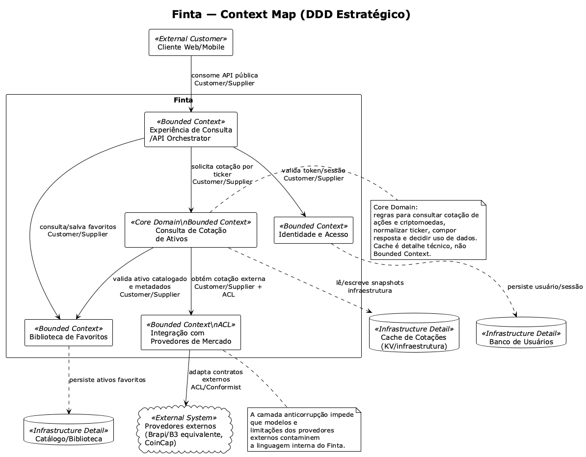

# Lab 9 — DDD Estratégico aplicado ao Finta

## 1. Identificação do domínio

O domínio considerado é o **Finta como um todo**: um sistema para consultar cotações de ativos financeiros, como ações e criptomoedas, e criar uma biblioteca de favoritos com ativos de interesse. O Finta não será tratado como um sistema completo de gestão financeira pessoal; o foco é a descoberta, consulta e organização de ativos favoritos.

| Subdomínio | Classificação | Justificativa |
|---|---|---|
| Consulta de cotação de ativos | **Core** | É a principal capacidade de negócio do Finta no recorte atual: consultar preço, variação, volume, moeda e atualização de ações e criptomoedas por ticker. |
| Biblioteca de favoritos | Suporte | Permite que o usuário organize ativos de interesse como favoritos. Sustenta o uso recorrente da consulta de cotações. |
| Identidade e acesso | Genérico | Cadastro, login e validação de sessão são necessários para proteger funcionalidades, mas não diferenciam o domínio de ativos financeiros. |
| Integração com provedores de mercado | Suporte | Viabiliza a obtenção de dados externos e isola diferenças entre provedores como Brapi/B3 equivalente e CoinCap. |
| Cache de cotações | Genério | Melhora latência, resiliência e custo, mas não será tratado como subdomínio/bounded context próprio. |
| Observabilidade e padronização de erros | Genérico | Capacidade transversal comum a outros sistemas. |

## 2. Definição de Bounded Contexts

### 2.1 Consulta de Cotação de Ativos — Core Domain

Responsável por aplicar a linguagem principal do domínio: ativo, ticker, tipo de ativo, cotação, preço, moeda, variação diária, volume e data de referência.

Responsabilidades:

- Receber solicitações de consulta de cotação.
- Validar e normalizar ticker informado.
- Diferenciar tipos de ativo, como ação e criptomoeda.
- Compor a resposta de cotação para o usuário.
- Decidir quando usar dados em cache ou buscar dados atualizados.
- Preservar a linguagem interna do Finta, sem vazar modelos dos provedores externos.

### 2.2 Biblioteca de Favoritos

Responsável pela biblioteca de favoritos do usuário: ativos salvos como favoritos, organização e recuperação de ativos de interesse.

Responsabilidades:

- Registrar ativos na biblioteca do usuário.
- Listar ativos favoritos.
- Remover ativos da biblioteca de favoritos.
- Associar usuário autenticado aos ativos favoritos.
- Guardar metadados do ativo relevantes para a experiência do Finta.

### 2.3 Identidade e Acesso

Responsável por autenticar usuários e fornecer identidade confiável aos demais contextos.

Responsabilidades:

- Cadastro de usuário.
- Login.
- Emissão de token/sessão.
- Validação de JWT/Bearer Token.
- Fornecimento dos dados mínimos do usuário autenticado.

### 2.4 Integração com Provedores de Mercado

Responsável por encapsular provedores externos de cotação e proteger o modelo interno do Finta.

Responsabilidades:

- Chamar APIs externas de ações e criptomoedas.
- Adaptar payloads externos para um formato interno normalizado.
- Tratar timeout, falhas, limites e circuit breaker.
- Esconder particularidades dos provedores externos.
- Atuar como **Anticorruption Layer**.

### 2.5 Experiência de Consulta / API Orchestrator

Responsável por coordenar a jornada síncrona de uso da aplicação.

Responsabilidades:

- Receber requisições públicas do frontend.
- Validar autenticação antes de acionar funcionalidades protegidas.
- Orquestrar chamadas entre Identidade, Consulta de Cotação e Biblioteca de Favoritos.
- Padronizar respostas públicas da API.

## 3. Linguagem Ubíqua — termo escolhido: Ticker

| Contexto | Significado de “Ticker” |
|---|---|
| Consulta de Cotação de Ativos | Identificador usado para consultar a cotação de um ativo. Deve estar normalizado para a regra interna do Finta, por exemplo `PETR4` ou `BTC`. |
| Biblioteca de Favoritos | Identificador pelo qual um ativo favorito é salvo, buscado e exibido na biblioteca do usuário. Aqui o ticker funciona como referência persistida de interesse do usuário. |
| Integração com Provedores de Mercado | Código aceito por uma API externa. Pode exigir adaptações específicas, como sufixos, pares de moeda ou formatos diferentes entre provedores. |
| Cache de Cotações | Parte da chave técnica usada para armazenar e recuperar snapshots de cotação. Neste contexto, o ticker é um identificador de armazenamento, não uma regra de negócio principal. |

Assim, o mesmo termo possui sentidos próximos, mas não idênticos. No core domain, “ticker” é uma abstração de negócio do Finta; na integração, ele é traduzido para o contrato de cada provedor; no cache, vira chave técnica.

## 4. Context Map

O context map foi representado em PlantUML no arquivo:

- [`diagramas/context-map.puml`](./diagramas/context-map.puml)
- [`diagramas/context-map.png`](./diagramas/context-map.png)

Principais relações:

| Relação | Padrão | Justificativa |
|---|---|---|
| Cliente → Experiência de Consulta/API Orchestrator | Customer/Supplier | O cliente consome uma API pública estável fornecida pelo Finta. |
| Experiência de Consulta → Identidade e Acesso | Customer/Supplier | A experiência depende da validação de usuário autenticado. |
| Experiência de Consulta → Consulta de Cotação | Customer/Supplier | O orquestrador solicita ao core a cotação de um ativo. |
| Experiência de Consulta → Biblioteca de Favoritos | Customer/Supplier | O orquestrador aciona funcionalidades de salvar/listar ativos favoritos. |
| Consulta de Cotação → Biblioteca de Favoritos | Customer/Supplier | A cotação pode consultar metadados de ativos favoritos/catalogados. |
| Consulta de Cotação → Integração com Provedores de Mercado | Customer/Supplier + Anticorruption Layer | O core precisa de dados externos, mas não deve incorporar modelos dos provedores. |
| Integração com Provedores de Mercado → Provedores externos | ACL/Conformist | O Finta precisa se adaptar aos contratos externos, isolando essa adaptação. |
| Consulta de Cotação → Cache de Cotações | Uso de infraestrutura | Cache é detalhe técnico para desempenho e resiliência, não bounded context próprio. |

## 5. Proposta de Microserviços

| Microserviço candidato | Bounded Context | Responsabilidades |
|---|---|---|
| `query-api-orchestrator` | Experiência de Consulta/API Orchestrator | Expor API pública, validar token, coordenar consulta de cotação e biblioteca de favoritos. |
| `asset-quote-service` | Consulta de Cotação de Ativos | Regras de consulta, normalização de ticker, composição da cotação, decisão de uso de cache e chamada para integração. |
| `favorite-library-service` | Biblioteca de Favoritos | Salvar, listar e remover ativos favoritos do usuário. |
| `identity-access-service` | Identidade e Acesso | Cadastro, login, emissão e validação de JWT. |
| `market-provider-integration-service` | Integração com Provedores de Mercado | Integração com provedores externos e tradução de contratos externos para o modelo interno. |

O cache de cotações permanece como dependência de infraestrutura usada pelo `asset-quote-service`, por exemplo via KV, Redis ou banco otimizado para leitura, sem virar microserviço autônomo neste desenho.

## 6. Evolução do serviço SOA escolhido

O serviço escolhido para evolução foi o **Serviço de Consulta de Cotação**, modelado no Lab 7 e implementado no Lab 8.

### Situação anterior — SOA

No desenho SOA anterior, o Serviço de Consulta de Cotação atuava como um serviço de tarefa/orquestrador. Ele concentrava o fluxo principal:

1. Receber solicitação do usuário.
2. Validar token Bearer.
3. Validar e normalizar o ativo solicitado.
4. Consultar cache.
5. Chamar provedor externo quando necessário.
6. Atualizar cache.
7. Retornar resposta padronizada ao cliente.

Essa abordagem funcionava bem para o fluxo implementado, mas misturava responsabilidades de aplicação, domínio, autenticação, cache e integração.

### Evolução proposta — DDD + microserviços

Na evolução conceitual proposta, o Serviço de Consulta de Cotação passa a ser refinado como o microserviço `asset-quote-service`, pertencente ao bounded context **Consulta de Cotação de Ativos**.

Ele mantém as responsabilidades centrais do domínio:

- interpretar o ticker informado;
- aplicar regras de consulta de cotação;
- compor a cotação no modelo interno do Finta;
- decidir se uma cotação em cache é aceitável;
- solicitar atualização externa quando necessário.

Responsabilidades removidas ou delegadas:

| Responsabilidade anterior | Novo destino |
|---|---|
| Cadastro, login e validação de JWT | `identity-access-service` |
| Exposição da API pública e coordenação da jornada completa | `query-api-orchestrator` |
| Chamada direta a Brapi/CoinCap e adaptação de contratos externos | `market-provider-integration-service` |
| Armazenamento técnico de snapshots | Cache como infraestrutura do `asset-quote-service` |
| Biblioteca de favoritos | `favorite-library-service` |

### Resultado da transformação

A transformação reduz o acoplamento e torna explícitas as fronteiras de negócio:

- O core domain fica concentrado na consulta de cotação de ativos.
- O modelo interno de cotação fica protegido dos provedores externos por uma camada anticorrupção.
- Identidade e acesso deixam de contaminar a lógica de cotação.
- A biblioteca de favoritos ganha responsabilidade própria.
- O cache permanece como otimização técnica, sem virar conceito de negócio principal.

Com isso, a solução SOA anterior evolui para uma proposta de microserviços orientada por Bounded Contexts, mantendo a orquestração síncrona do fluxo principal, mas com responsabilidades mais bem separadas.
